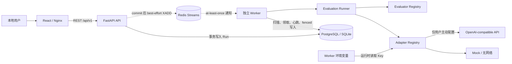

# LLMBenchLab

[](https://github.com/CWNU-Open-Source-Community/LLMBenchLab/actions/workflows/ci.yml)

GitHub：[`CWNU-Open-Source-Community/LLMBenchLab`](https://github.com/CWNU-Open-Source-Community/LLMBenchLab)

LLMBenchLab 是一个面向个人开发者与研究人员的轻量级 LLM 评测工作台。它把模型注册、版本化 Benchmark、后台评测、逐题证据、汇总指标和排行榜放进一条可审计的本地流程，并以“默认离线、严格评分、结果可复现”为首要约束。

当前版本在保留 SQLite 单机兼容路径的同时，已经交付 Phase 2 的可靠执行基础：PostgreSQL 是 Compose/部署目标和任务事实来源，Redis Streams 提供可重复、可丢失的低延迟通知，独立 Worker 通过数据库租约执行任务。完全不需要 API Key 的 Mock Demo 仍是默认验收路径；OpenAI-compatible Chat Completions 适配器及真实 Provider 调用始终是用户主动启用的可选能力。

## 当前状态

- 版本：`0.1.0`（development baseline，尚未发布正式 Release）
- 评测协议：`llmbenchlab-protocol-v1`
- Phase 0（治理、需求、架构和协议）已完成。
- Phase 1 MVP 已具备完整垂直链路：注册模型、载入/导入 Benchmark、创建 Run、逐题持久化、结果聚合和前端展示。
- Phase 2 可靠执行基础已通过真实 PostgreSQL/Redis 和进程故障验证：API 只持久化并通知，独立 Worker 使用租约、心跳、fencing、幂等 Response、有限重试和数据库恢复完成 Run。
- 默认验收路径只使用 Mock adapter 和临时 SQLite，不访问真实模型服务，也不产生模型费用。
- Phase 2 仍为 `in_progress`：Provider 限流、预算、完整背压、公平调度、完整审计、历史 counters/延迟指标和性能基线尚未完成；Phase 3–6 仍为计划能力。

最新、可复核的完成状态与测试证据以 [`docs/PROJECT_STATUS.md`](docs/PROJECT_STATUS.md) 和 [`docs/worklogs/`](docs/worklogs/) 为准；Roadmap 中的计划能力不等于已交付能力。

## 核心特性

- **完全离线的 Mock Demo**：15 道原创双语演示题，覆盖 exact match、multiple choice 和 numeric；结果必须明确标记为 Demo，不能当作正式模型能力结论。
- **模型注册表**：支持 `mock` 与 `openai_compatible`，记录远端模型名、默认生成参数和可选价格信息。
- **版本化 Benchmark**：严格校验 `manifest.json` 与 `questions.jsonl`，支持受限 ZIP 导入、稳定 SHA-256 和导入冲突检测。
- **确定性评分**：内置三类 Evaluator；解析失败和单题调用失败严格计 0 分，并保留错误证据。
- **可解释指标**：严格总分 `score`、完成率 `completion_rate` 和已回答准确率 `answered_accuracy` 分开呈现，避免把缺失回答隐藏在成功样本中。
- **可靠任务执行基础**：API 先提交 Run，再 best-effort 发送 Redis Streams 通知；独立 Worker 以数据库时间、租约和 fencing token 领取任务，并通过数据库扫描从通知丢失或进程故障中恢复。
- **幂等与恢复**：同一 Run/Question 只有一条计分证据；租约心跳、有限 attempt、退避、取消、过期接管和 dead-letter 都由数据库裁决，Redis 不是状态数据库。
- **可复现记录**：持久化模型参数、Prompt、Benchmark Hash、协议版本、代码 commit（可用时）、raw response、parsed answer、参考答案快照和逐题评分。
- **六个前端页面**：Dashboard、Models、Benchmarks、New Run、Run Detail 和 Leaderboard，含加载、空数据、错误状态与响应式布局。
- **秘密最小化**：数据库和 API 只保存/返回 `api_key_env` 的变量名，绝不接收或持久化对应的 Key 值。
- **开发交付完整**：Alembic、Ruff、pytest、ESLint、TypeScript、Vitest、Vite production build、GitHub Actions、Makefile，以及 PostgreSQL、Redis、API、Worker、frontend 和一次性 migrate 组成的 Docker Compose。

## 产品截图

> **真实截图尚未提供。** 本节仅保留截图位置说明，仓库没有使用设计稿、假数据图片或生成图片冒充已运行界面。启动本地服务后可在 `http://127.0.0.1:5173` 查看真实 UI；后续发布经实际运行验证的截图时，应同时注明 commit、数据集版本和是否为 Demo。

## 技术栈

| 层次 | 技术 |
| --- | --- |
| 后端 | Python 3.11+、FastAPI、Pydantic v2、SQLAlchemy 2、Alembic、Uvicorn、httpx |
| 数据 | PostgreSQL（Compose/部署目标）、SQLite（单 Worker 本地兼容）；版本化 JSON/JSONL Benchmark；SHA-256 数据集指纹 |
| 任务 | Redis 7 Streams 通知、数据库租约/心跳/fencing、独立 Worker、at-least-once 投递 |
| 前端 | React 19、TypeScript、Vite 7、React Router、Recharts、Lucide |
| 测试与质量 | pytest、httpx MockTransport、Vitest、Testing Library、Ruff、ESLint、TypeScript |
| 交付 | Make、六服务 Docker Compose、Nginx、GitHub Actions |

## 架构



API 创建 Run 时先提交数据库，再尝试发送 Redis 通知，并立即返回 `202`；通知失败不回滚数据库事实。Worker 优先从数据库对账，并可消费重复 Redis 消息；每次写入都校验当前租约 owner/token，恢复时跳过已有 Response。数据库因此是唯一事实来源，Redis、日志、指标和 Worker 内存都不能覆盖 Run 状态。前端轮询 Run，进入 `completed`、`failed` 或 `cancelled` 终态后停止。详细设计见 [`docs/ARCHITECTURE.md`](docs/ARCHITECTURE.md)，评分语义见 [`docs/BENCHMARK_PROTOCOL.md`](docs/BENCHMARK_PROTOCOL.md)。

任务投递是 at-least-once，本地 Response 和聚合是幂等的；这不等于 Provider exactly-once。若 Worker 在 Provider 已响应、本地 Response 提交前崩溃，接管 Worker 可能再次调用 Provider 并产生额外费用。

## 仓库结构

```text
LLMBenchLab/
├── backend/
│   ├── alembic/             # 数据库迁移
│   ├── app/
│   │   ├── adapters/        # Mock / OpenAI-compatible
│   │   ├── api/v1/          # REST 路由
│   │   ├── core/            # 配置、日志、常量、时间
│   │   ├── db/              # Session 与初始化
│   │   ├── evaluators/      # 三类确定性评分器
│   │   ├── models/          # SQLAlchemy 实体
│   │   ├── runners/         # 租约仓储与评测 Runner
│   │   ├── schemas/         # Pydantic API Schema
│   │   ├── services/        # Dataset 与业务服务
│   │   ├── task_queue/      # Redis Streams 通知
│   │   └── workers/         # 独立 Worker 服务
│   └── tests/               # 单元、集成与 Smoke 测试
├── frontend/
│   ├── src/api/             # 集中式 API Client 与类型
│   ├── src/components/      # 通用 UI 组件
│   ├── src/pages/           # 六个产品页面
│   └── tests/               # Vitest / Testing Library
├── benchmarks/demo-general/ # 15 道原创 Demo 题
├── docs/
│   ├── decisions/           # ADR
│   ├── phases/              # Phase 0–6 计划与验收
│   ├── templates/           # 计划、工作日志、ADR、Phase 模板
│   └── worklogs/            # 实际执行记录
├── scripts/                 # setup、dev、offline smoke、Phase 2 验收
├── compose.yaml
├── Makefile
└── .env.example
```

## Quickstart

前置要求：Python 3.11 或更新版本、[`uv`](https://docs.astral.sh/uv/)、Node.js 22 或兼容版本，以及 npm。Docker 仅在 Compose 模式需要。

```bash
git clone https://github.com/OWNER/LLMBenchLab.git
cd LLMBenchLab
make setup
make dev
```

`make setup` 会按锁文件安装前后端依赖、仅在 `.env` 不存在时从 `.env.example` 创建它，并执行 Alembic migration；已有 `.env` 不会被覆盖。该命令可重复执行。若检测到由早期开发版自动建表留下的未版本化 SQLite，只有在结构与完整性严格匹配已知版本时才会先创建同目录 `.bak` 一致性备份并无损收养；未知或部分结构会在写入版本标记前停止。普通 API/Worker 启动不会隐式建表，未迁移时会提示先运行 `make setup` 或 `make migrate`。`make dev` 在一个终端启动 API、独立 Worker 和 frontend，`Ctrl-C` 会一起停止。

默认地址：

- Web：`http://127.0.0.1:5173`
- API：`http://127.0.0.1:8000`
- OpenAPI：`http://127.0.0.1:8000/docs`

存活、健康、就绪与任务 gauges：

```bash
curl -sS http://127.0.0.1:8000/api/v1/live
curl -sS http://127.0.0.1:8000/api/v1/health
curl -sS http://127.0.0.1:8000/api/v1/ready
curl -sS http://127.0.0.1:8000/api/v1/tasks/metrics
```

`/live` 不访问外部依赖，`/health` 仅检查数据库，`/ready` 检查数据库、Alembic head 和 Redis。Redis 不可用时 `/ready` 返回 `503/degraded`，但数据库可用时 API 仍可提交 Run，Worker 也可仅靠数据库对账恢复。`/ready` 对 `asyncio.to_thread` 的等待超时不会取消已进入线程的同步数据库驱动调用，真正资源上界仍由驱动/连接池 timeout 约束。`/tasks/metrics` 只是数据库当前事实派生的 gauges，不是完整历史 counters、延迟监控或审计日志。

API 接受经校验的 `X-Request-ID`，非法或缺失时自动生成，并在每个响应中返回。LLMBenchLab **应用 logger** 使用字段白名单的脱敏 JSON，关联 request/run/question/worker/attempt/lease 事件；这一保证不涵盖所有 Uvicorn 或 access log handler，因此凭据和敏感内容仍绝不得放在 URL、header 或请求路径中。

如需分别观察日志，可在三个终端运行 `make backend`、`make worker` 和 `make frontend`。只启动 API 时，新 Run 会持久化为 `pending`，但不会在 API 进程内执行。本地 SQLite 只支持一个 Worker；Redis URL 可留空，Worker 将使用数据库对账。所有命令可通过 `make help` 查看；更完整的环境变量、迁移和排障说明见 [`docs/DEPLOYMENT.md`](docs/DEPLOYMENT.md)。

## Mock Demo：完整离线流程

这条路径不需要任何 API Key，不会访问网络模型：

1. 执行 `make setup` 和 `make dev`，打开 `http://127.0.0.1:5173`。
2. 进入 **模型** 页面，新建模型；名称可填 `Offline Mock`，Provider 选择 `mock`，保持启用。Mock 不需要 Base URL、远端模型名或 `api_key_env`。
3. 进入 **评测集** 页面，点击重载/载入内置 Demo。确认它显示 `demo-general`、版本 `1.0.0`、15 道题，以及“Demo 数据，不代表正式模型能力”的提示。
4. 点击 **新建评测**，选择刚注册的 Mock 和 Demo Benchmark。默认参数可直接使用；推荐可复现基线为 `temperature=0`、`top_p=1`、`max_tokens=256`、`seed=42`、`concurrency=1`。
5. 提交后进入 Run Detail。页面会轮询 `pending/running` 状态，展示进度、配置快照和逐题结果，并在终态停止轮询。
6. 确定性 Mock Demo 正常应完成 15/15，严格总分、完成率和已回答准确率均为 100；逐题区域会分别显示 raw response、parsed answer、reference、score 和 error。
7. 进入 **排行榜**，按模型或 Benchmark 筛选，核对协议版本、数据集 Hash、完成率和醒目的 Demo 标识。该成绩只证明本地垂直链路可工作。

同一流程也可通过 API 完成：

```bash
# 1. 注册离线 Mock；保存响应中的 id 为 MODEL_ID
curl -sS -X POST http://127.0.0.1:8000/api/v1/models \
  -H 'Content-Type: application/json' \
  -d '{"name":"Offline Mock","provider_type":"mock","enabled":true}'

# 2. 幂等载入 Demo；保存响应中的 id 为 BENCHMARK_ID
curl -sS -X POST http://127.0.0.1:8000/api/v1/benchmarks/reload-demo

# 3. 替换两个占位 ID，创建 Run；保存响应中的 id 为 RUN_ID
curl -sS -X POST http://127.0.0.1:8000/api/v1/runs \
  -H 'Content-Type: application/json' \
  -d '{"model_id":"<MODEL_ID>","benchmark_id":"<BENCHMARK_ID>","temperature":0,"top_p":1,"max_tokens":256,"seed":42,"concurrency":1}'

# 4. 有限次数轮询至终态，再检查逐题证据与排行榜
curl -sS 'http://127.0.0.1:8000/api/v1/runs/<RUN_ID>'
curl -sS 'http://127.0.0.1:8000/api/v1/runs/<RUN_ID>/responses?limit=100'
curl -sS 'http://127.0.0.1:8000/api/v1/leaderboard?benchmark_id=<BENCHMARK_ID>&order=score_desc'
```

可直接运行自动化垂直切片：

```bash
make smoke
```

Smoke 使用临时 SQLite 和 Mock adapter，不接触开发数据库或真实 Provider。

## 接入 OpenAI-compatible Provider

LLMBenchLab 使用 Chat Completions 风格接口。若 `base_url` 为 `https://provider.example/v1`，Adapter 会请求 `https://provider.example/v1/chat/completions`；如果填写的 URL 已以 `/chat/completions` 结尾，则不会重复追加。

1. 选择一个 Worker 环境变量名，例如 `LOCAL_COMPAT_API_KEY`，通过操作系统 Keychain、秘密管理器或受控 shell 把真实 Key 注入**执行 `make worker` 或 Worker 容器的进程环境**。
2. 在 Models 页面或 `POST /api/v1/models` 中把 `api_key_env` 填为字符串 `LOCAL_COMPAT_API_KEY`。这里只填变量名，不能填真实值。
3. 同时填写可信的 `base_url` 和 Provider 的 `remote_model_name`，然后创建 Run。注册模型本身不会调用 Provider；Run 执行时 Adapter 才读取环境变量并发起请求。

API 示例中的域名是故意无效的占位符：

```bash
curl -sS -X POST http://127.0.0.1:8000/api/v1/models \
  -H 'Content-Type: application/json' \
  -d '{
    "name":"My Compatible Model",
    "provider_type":"openai_compatible",
    "base_url":"https://provider.example.invalid/v1",
    "remote_model_name":"replace-with-provider-model-name",
    "api_key_env":"LOCAL_COMPAT_API_KEY",
    "enabled":true,
    "default_parameters":{"temperature":0}
  }'
```

真实 Key 不应进入 API JSON、数据库、Git、Issue、日志、截图或 `VITE_*` 变量。Model Schema 会拒绝 `base_url` query，并将 `default_parameters` 限定为 `temperature`、`top_p`、`max_tokens`、`seed` 四个严格校验的生成字段；浏览器不会直接调用 Provider。当前 MVP 尚无 SSRF allowlist，只可使用已审查的 Provider 地址，并在执行前确认题目外发许可、数据政策和费用。缺少目标环境变量时，相关单题会安全记录为 `missing_api_key`。

## 测试与质量检查

从仓库根目录运行：

```bash
make lint       # Ruff lint/format check + ESLint + TypeScript
make test       # 完整 pytest + Vitest
make smoke      # 纯离线 Mock 垂直链路
make phase2-acceptance  # 隔离 Compose 中的真实故障验收
```

前端 production build 是独立门槛：

```bash
cd frontend
npm run build
```

测试策略的关键约束：自动化和 CI 不配置 Provider Key，不调用真实或付费 API；OpenAI-compatible 协议测试使用进程内 `httpx.MockTransport`；Smoke 在隔离 SQLite 中证明 API 不执行任务、再由独立 WorkerService 完成 Mock Run；CI 另用真实 PostgreSQL/Redis 和完整 Compose 故障注入验证并发领取、API/Worker 重启、Redis 故障、取消、租约过期与迁移往返。前端 API 使用 stub/mock。完整测试矩阵与手工验收见 [`docs/TESTING.md`](docs/TESTING.md)。

## Docker Compose

Docker 模式包含六个 service：长运行的 `postgres`、`redis`、`api`、`worker`、`frontend`，以及一次性 `migrate`。`migrate` 是 Compose 中唯一执行 Alembic 升级的服务；API/Worker 只在启动时检查 schema 已在 head。PostgreSQL 和开启 AOF 的 Redis 分别使用 named volume：

```bash
make docker-up
```

默认地址：

- Web（Nginx 同源代理 `/api/`）：`http://127.0.0.1:8080`
- API 就绪检查：`http://127.0.0.1:8000/api/v1/ready`

API 和 frontend 的 host ports 明确绑定 loopback，PostgreSQL/Redis 不发布 host port。Worker 容器的 healthcheck 是**依赖能力探针**：数据库或 schema 失败时不健康，Redis 失败时报告 degraded 但仍退出 0，因为数据库对账可用。它不检查 Worker 主循环是否活着，不能当作 event-loop liveness 证明。

停止服务并保留数据：

```bash
make docker-down
```

配置静态校验：

```bash
docker compose config
```

`docker compose down -v` 会删除 PostgreSQL/Redis volumes，属于破坏性操作；除非明确要丢弃数据且已有备份，否则不要执行。这一 Compose 拓扑用于本地可靠性开发与验收，仍然没有鉴权、TLS、PITR、权限拆分或生产监控，不是公网、HA 或生产部署方案。备份、恢复、Provider secret override 和完整容器说明见 [`docs/DEPLOYMENT.md`](docs/DEPLOYMENT.md)。

## SQLite → PostgreSQL 显式导入

导入器只支持一次性、单向迁移，不是在线复制。必须先停止 SQLite 源的 API/Worker 和新 Run 创建，排空、取消或终结所有 `pending/running` Run，并准备一个已迁移到当前 Alembic head 的**空、离线 PostgreSQL 目标**。导入器以 SQLite read-only URI 读源，检查 integrity/FK/head/active Run；目标使用 advisory lock、`ACCESS EXCLUSIVE` table locks 和一个事务复制五张核心表。

带凭据的 PostgreSQL DSN 必须通过受控环境变量提供，不得放入命令行：

```bash
# 先由 secret manager/受控 shell 设置 LLMBENCHLAB_IMPORT_TARGET_URL
cd backend
uv run python -m app.db.import_sqlite \
  --source /absolute/path/to/stopped-llmbenchlab.db \
  --target-env LLMBENCHLAB_IMPORT_TARGET_URL
```

`--target` 只接受不含 password 的 PostgreSQL URL；默认 `--target-env` 名为 `LLMBENCHLAB_DATABASE_URL`。工具对 source、precommit target 和 postcommit target 输出不含行内容的 row count、主键集 SHA-256 和 canonical row SHA-256。成功的 postcommit 对账在独立、只读 `REPEATABLE READ` 事务中取稳定快照。

| 退出码 | 含义 | 目标状态与操作 |
| ---: | --- | --- |
| `0` | 已提交且 postcommit 对账完成 | 核对三组摘要后再启动服务 |
| `2` | preflight/copy/precommit 对账等普通失败 | 如已开始目标事务则整体 rollback；空目标保持空 |
| `3` | `committed_but_verification_failed` | 目标已提交完整 precommit 快照，但 postcommit 验证或报告失败；停止服务并独立对账 |
| `4` | `commit_outcome_unknown` | PostgreSQL 未确认 COMMIT；原子事务意味着目标可能为空，也可能已完整提交 |

退出码 `3` 或 `4` 后**禁止盲目重试**。应先隔离目标，检查 Alembic head、五表行数/主键集/canonical hash 和工具已输出的对账证据；非空目标会拒绝再次导入。工具不提供 PostgreSQL → SQLite 反向同步，回滚依赖保留的 SQLite 源/备份或单独验证的导出流程。

## Roadmap

| 阶段 | 主题 | 状态摘要 |
| --- | --- | --- |
| Phase 0 | 项目治理、需求、架构、协议 | 已完成 |
| Phase 1 | FastAPI + React + SQLite 的 MVP 垂直链路 | 已完成 |
| Phase 2 | PostgreSQL、Redis、独立 Worker、恢复与可观测性 | `in_progress`：可靠基础已验证，治理/完整观测/性能尚未完成 |
| Phase 3 | 合规标准 Benchmark 与隔离代码评测 | 计划中 |
| Phase 4 | LLM Judge、人工校准与 Arena | 计划中 |
| Phase 5 | Agent、工具调用与 Live Benchmark | 计划中 |
| Phase 6 | 公共发布、多用户、安全与运营加固 | 计划中 |

每个阶段的目标、非目标、依赖、验收标准和风险见 [`docs/ROADMAP.md`](docs/ROADMAP.md) 与 [`docs/phases/`](docs/phases/)。

## 安全

- MVP 没有认证、授权、限流、TLS、多租户隔离或生产级秘密管理，**不得直接暴露到公网**。
- 本地 Make 模式默认只监听 `127.0.0.1`；CORS 是浏览器策略，不是访问控制。
- API 与数据库只保存 `api_key_env` 名称；真实 Key 只由执行 Adapter 的 Worker 在请求时从环境读取。
- `VITE_*` 会进入浏览器构建产物，永远不能用于存放秘密。
- Benchmark ZIP 会做路径、文件类型、大小、压缩比、Schema 和题数校验，但导入者仍需审查来源、许可证、敏感数据和提示注入风险。
- 任意 OpenAI-compatible `base_url` 存在 SSRF 与数据外发风险；公开部署前必须加入地址策略、出站隔离、鉴权和费用控制。
- SQLite/PostgreSQL 会保存题目、参考答案、原始回答和错误证据；数据库、volume、导入源与备份需使用最小权限和加密存储保护。

威胁模型、秘密轮换和公开部署前门槛见 [`docs/SECURITY.md`](docs/SECURITY.md)。

## 当前限制

- SQLite 兼容路径只支持一个 Worker 和低并发；多 Worker 的真实租约协调路径以 PostgreSQL 为目标。
- API 重启不拥有或改写 Run；Worker 异常退出后由数据库租约过期和对账恢复。这是受限的可靠基础，不是 HA/SLA 保证。
- 取消是协作式的；已经发出的上游请求可能要等到返回或超时。
- at-least-once 恢复不保证 Provider 调用或计费 exactly-once；数据库只保留一份幂等的 Response/费用证据。
- 没有预算上限、Provider 级速率限制、队列背压或端到端费用保护。
- OpenAI-compatible 只实现 Chat Completions 共同子集，不保证覆盖各供应商私有参数和响应扩展。
- 当前只含原创 Demo，不捆绑 MMLU-Pro、GPQA、IFEval 等标准数据集，也不执行任何不可信代码。
- 评分仅含三个确定性客观 Evaluator；没有 LLM Judge、人工评审、Arena、Agent 或 Live Benchmark。
- Dataset Hash 用于一致性检查，不是发布者签名，也不能证明数据没有污染。
- `/tasks/metrics` 只提供当前 DB gauges；历史 counters/延迟、完整审计、监控面板和告警尚未完成。
- 当前没有正式性能基线、灾难恢复 SLA、SBOM 或生产部署支持。

## 贡献

开始前请阅读 [`AGENTS.md`](AGENTS.md)、[`docs/PROJECT_STATUS.md`](docs/PROJECT_STATUS.md)、当前 Phase 文档和 [`CONTRIBUTING.md`](CONTRIBUTING.md)。贡献应保持小而可审查，新增行为必须有测试；涉及评分、数据格式、公开 API、持久化或安全边界的修改，需要同步更新协议、ADR 或相关文档。

提交 Pull Request 前至少运行：

```bash
make lint
make test
make smoke
cd frontend && npm run build
```

任何自动化测试都不得使用真实 Provider 或付费 API。无法运行的检查必须如实记录命令、原因和剩余风险，不能写成已通过。

## License

本项目采用 [MIT License](LICENSE)。
