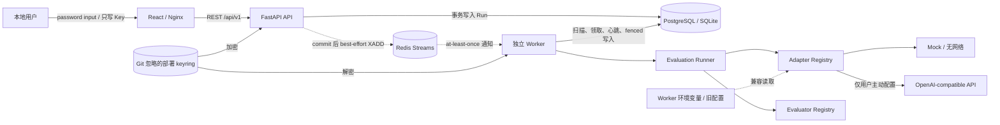

# LLMBenchLab

[](https://github.com/CWNU-Open-Source-Community/LLMBenchLab/actions/workflows/ci.yml)

GitHub：[`CWNU-Open-Source-Community/LLMBenchLab`](https://github.com/CWNU-Open-Source-Community/LLMBenchLab)

LLMBenchLab 是一个面向个人开发者与研究人员的轻量级 LLM 评测工作台。它把模型注册、版本化 Benchmark、后台评测、逐题证据、汇总指标和排行榜放进一条可审计的本地流程，并以“默认离线、严格评分、结果可复现”为首要约束。

当前版本在保留 SQLite 单机兼容路径的同时，已经交付 Phase 2 的可靠执行与治理候选；P2-06 可观测性/审计保留切片已完成实现、clean evidence 与 evidence-doc 精确 SHA CI，状态为 `completed`。PostgreSQL 是 Compose/部署目标和任务、四层治理、逐 HTTP attempt ledger、typed audit 与 Worker progress 的事实来源，Redis Streams 只提供可重复、可丢失的低延迟通知，独立 Worker 通过数据库租约和公平 question quantum 执行任务。完全不需要 API Key 的 Mock Demo 仍是默认验收路径；OpenAI-compatible Chat Completions 适配器及真实 Provider 调用始终是用户主动启用的可选能力。

## 当前状态

- 版本：`0.1.0`（development baseline，尚未发布正式 Release）
- 评测协议：`llmbenchlab-protocol-v1`
- Phase 0（治理、需求、架构和协议）已完成。
- Phase 1 MVP 已具备完整垂直链路：注册模型、载入/导入 Benchmark、创建 Run、逐题持久化、结果聚合和前端展示。
- Phase 2 候选已通过真实 PostgreSQL/Redis 和进程故障验证：除租约、心跳、fencing、幂等 Response 与数据库恢复外，Web/API managed Run 还具有 global/provider/model/run 四层数据库 admission、fixed-minute RPM/TPM、lifetime request/Token/cost budget、有限 backlog、公平 slice、逐 attempt reservation/settlement、typed audit 和历史延迟。
- 当前 Alembic head 为 data-only `20260830_0007`：没有显式 `input_token_reservation` 时，输入 Token 估算只用于观测，不再写成 hard reservation 或参与 cost/overdraw 裁决；Provider actual usage 仍完整保存。显式 input/output 预留及由完整上界和价格计算的 reserved cost 超额仍按原规则 fail closed。
- 可信本地 CLI 已提供 MMLU-Pro 与 GPQA-Diamond 的固定来源转换、真实 OpenAI-compatible 预检、可恢复执行和完整报告导出；这是 Phase 3 的客观题垂直切片，不代表 Phase 2 或 Phase 3 已完成。
- 自动化、CI、Compose 故障验收和容量演练的模型执行都只使用 Mock；根据层级使用临时 SQLite 或隔离 PostgreSQL 16/Redis 7，不访问真实模型服务，也不产生模型费用。
- Phase 2 仍为 `in_progress`。P2-01 已完整交付：`P2-local-control-plane-v2` 在 clean commit `b6a35fef1dd069ebb54b69955058915c722aa34d` 从零完成 1 次 warm-up + 5 次 measured trial，23/23 SLO 与逐轮硬门禁全部通过，容量模型为 `qualified`；该实现的 [GitHub Actions run 33146681285](https://github.com/CWNU-Open-Source-Community/LLMBenchLab/actions/runs/33146681285) 4/4 成功，证据文档收尾 commit `875f13a253c40b7573d45c6287385e60f2bb8f04` 的 [run 33150080341](https://github.com/CWNU-Open-Source-Community/LLMBenchLab/actions/runs/33150080341) 也已 4/4 成功。
- P2-06 状态为 `completed`。实现 SHA [`9a20676dcf545040782f04c166205d0043345753`](https://github.com/CWNU-Open-Source-Community/LLMBenchLab/commit/9a20676dcf545040782f04c166205d0043345753) 已 push 到当前分支并进入 [PR #3](https://github.com/CWNU-Open-Source-Community/LLMBenchLab/pull/3)，其精确 SHA 的 [GitHub Actions run 33164609388](https://github.com/CWNU-Open-Source-Community/LLMBenchLab/actions/runs/33164609388) 4/4 成功。绑定同一 clean SHA 的 Compose acceptance 9/9 通过，evidence 为 `.pytest_cache/artifacts/phase2-acceptance/llmbenchlab-p2-92e173eeee28/evidence.json`（SHA-256 `e4ffb8668fd3fa62d59b5d83f5c29eede35b327d88e6099345acd5950670fc47`），Worker expected/registered/live/stalled/shortfall=`2/2/2/0/0` 且 cleanup C/V/N 全空；clean capacity evidence 为 `.pytest_cache/artifacts/phase2-capacity/llmbenchlab-p2-ca5673061b0f/evidence.json`（SHA-256 `2382f9138f09028f269d76c341b236dd4089d678c8a2323582045fac2b4f5039`），1W/2W/burst QPS=`7.267474/12.962228/9.333604`、wall=`8.255963/4.628834/6.428385s`，最终 18 Runs/270 Responses/270 QuestionExecutions/271 reservations/1230 audit，0 question error/drift/duplicate/PEL/lag，Worker expected=2、shortfall=0，cleanup C/V/N/image 全零且 image counters=`1/1/0/0`。这是 Mock-only 单机观测，不是生产或真实 Provider SLO；此前 dirty evidence 继续保留为历史，不替代该 clean-SHA 结果。Evidence-doc commit [`ec2959680459a14aa308bd4d9ebcc6bb7bfcf3a6`](https://github.com/CWNU-Open-Source-Community/LLMBenchLab/commit/ec2959680459a14aa308bd4d9ebcc6bb7bfcf3a6) 已 push，其精确 SHA 的 [run 33165775037](https://github.com/CWNU-Open-Source-Community/LLMBenchLab/actions/runs/33165775037) 4/4 成功，完成 P2-06 仓库级收尾。
- P3-06 Run Detail 热力图/live metrics 已完成本地实现与验证：backend/frontend target `37/32 passed`，完整 backend `964 passed, 33 skipped`、frontend `64 passed`，lint、Mock smoke、build、Compose config 和目标 198 题 Run 的 desktop/768/375、键盘/Tooltip/console 实页验收通过；12,032/20,000 题边界为自动化虚拟化测试。该切片仍为 `in_progress`，等待 commit/push 与远端精确 SHA CI。
- P2-07 状态为 `planned`，ADR-0016、独立计划和工作日志已建立，但功能尚未实现；后续才开始数据库/keyring 配对 backup/restore、Redis 重建、Worker 扩缩/告警处置和剩余故障矩阵，因此 Phase 2 仍为 `in_progress`。Phase 3 已有客观数据与本地验证完成的 P3-06 UI 切片，但其余 Phase 3–6 能力仍未完成。

最新、可复核的完成状态与测试证据以 [`docs/PROJECT_STATUS.md`](docs/PROJECT_STATUS.md) 和 [`docs/worklogs/`](docs/worklogs/) 为准；Roadmap 中的计划能力不等于已交付能力。

## 核心特性

- **完全离线的 Mock Demo**：15 道原创双语演示题，覆盖 exact match、multiple choice 和 numeric；结果必须明确标记为 Demo，不能当作正式模型能力结论。
- **模型注册表**：支持 `mock` 与 `openai_compatible`，记录远端模型名、默认生成参数和可选价格信息。
- **版本化 Benchmark**：严格校验 `manifest.json` 与 `questions.jsonl`，支持受限 ZIP 导入、稳定 SHA-256 和导入冲突检测。
- **固定标准数据集供应链**：MMLU-Pro test/validation 与 GPQA-Diamond 使用固定 revision、源文件 SHA-256、转换器版本和确定性 profile/选项重排；第三方题目只落在 Git 忽略的本地 `artifacts/`。
- **真实模型本地入口**：`llmbenchlab-evaluate prepare/run/resume/report` 完成下载、模型发现、付费 canary、显式确认、有界执行、缺失题恢复和全量证据导出；Key 只来自环境变量或隐藏输入，远端 Provider 必须使用 HTTPS，明文 HTTP 仅允许 loopback。
- **确定性评分**：内置三类 Evaluator；解析失败和单题调用失败严格计 0 分，并保留错误证据。
- **可解释指标与动态进度**：严格总分 `score`、完成率 `completion_rate` 和已回答准确率 `answered_accuracy` 分开呈现，避免把缺失回答隐藏在成功样本中；Run Detail 以固定 512 题轻量 block 呈现通过、普通答错、执行异常、未执行四态热力图，并从后端同快照证据实时刷新主指标，避免把 `error_questions` 误读为全部错题。
- **可靠任务执行基础**：API 先提交 Run，再 best-effort 发送 Redis Streams 通知；独立 Worker 以数据库时间、租约和 fencing token 领取任务，并通过数据库扫描从通知丢失或进程故障中恢复；大快照加载移出事件循环，已领取 Run 在物化题目时仍可续租。
- **幂等与恢复**：同一 Run/Question 只有一条计分证据；租约心跳、有限 attempt、退避、取消、过期接管和 dead-letter 都由数据库裁决，Redis 不是状态数据库。
- **数据库权威治理**：Web/API admission 把版本化完整 policy 冻结进 Run；global/provider/model/run 四层并发、RPM/TPM 和累计预算在固定锁序中共同裁决，backlog 满时在提交前稳定拒绝，Token/cost hard limit 缺少显式上界或价格时 fail closed。非显式输入估算不会冒充 hard reservation；actual usage 仍保留，只有实际用量超过显式预留才触发对应 overdraw。
- **逐 Provider attempt 账本与公平调度**：每次 HTTP attempt 先 reserve、再持久化 `send_started`、最后 actual/conservative settlement；可证明未发送的 release 保留终态 ledger，另起 generation 并重试当前未发送 ordinal，不重置之前已发送的 HTTP retry。Worker 每个 lease 只新增有界 question quantum，按最久未获服务顺序 cooperative yield，不把让出误计为失败。
- **可审计观测与受控保留**：typed、应用 append-only audit 以稳定 event key 去重；`/tasks/history` 在同一读取快照中校验 retained audit 后给出 counters 与 Run latency，`/metrics/prometheus` 用固定 gauge/enum label、硬样本上限和进程内 single-flight 暴露同源快照。Worker generation 只在真实 scan/claim/lease-heartbeat/progress 后按数据库 UTC 合并刷新，dependency probe 仍明确不检查主循环。八条 Prometheus 规则附固定 Runbook；`llmbenchlab-audit-retention` 提供 canonical JSONL archive、离线 verify、reconcile、精确 restore/delete，默认不删除且不把普通 hash 冒充 WORM。Run created/finished、credential audit 和逐题 Provider 元数据继续遵守非秘密边界。
- **可复现记录**：持久化模型参数、Prompt、Benchmark Hash、协议版本、代码 commit（可用时）、raw response、parsed answer、参考答案快照和逐题评分。
- **七个前端页面**：Dashboard、Models、Benchmarks、Evaluation Runs、New Run、Run Detail 和 Leaderboard；评测记录页可找回全部状态的 Run，详情证据按 100 条分页。Run Detail 会明确区分 `managed`、`delayed`、`exhausted` 和 `legacy_unmanaged`，对可公开的稳定 reason 给出中文说明并以 UTC 显示最早重调度时间；未知 reason 不原样反射。热力图每秒只读取小型 block index 和变化 block，不下载全量题目/回答正文；精确 Run Token 因部分 usage 缺失而未知时，页面仍显示全量 Response 的已知小计、输入/输出覆盖率与“完整总量未知”，不会把部分证据冒充账单真值。
- **Web 只写凭据**：用户可在 Models 表单直接粘贴 API Key；API 不把凭据流中的原值复制到公开 Model/Run-model 字段，数据库只保存由独立 keyring 加密的 AES-GCM 密文。旧 `api_key_env` 模型仍兼容；Provider 返回证据会递归检查对象键/JSON 标量，当前 Key 的精确回显会在进入 Runner/持久化前替换为 `[REDACTED]`。这不是对无关 Benchmark/Question 内容的全局字面扫描。
- **开发交付完整**：Alembic、Ruff、pytest、ESLint、TypeScript、Vitest、Vite production build、GitHub Actions、Makefile，以及 PostgreSQL、Redis、API、Worker、frontend 和一次性 migrate 组成的 Docker Compose。

## 产品截图

> **真实截图尚未提供。** 本节仅保留截图位置说明，仓库没有使用设计稿、假数据图片或生成图片冒充已运行界面。启动本地服务后可在 `http://127.0.0.1:5173` 查看真实 UI；后续发布经实际运行验证的截图时，应同时注明 commit、数据集版本和是否为 Demo。

## 技术栈

| 层次 | 技术 |
| --- | --- |
| 后端 | Python 3.11+、FastAPI、Pydantic v2、SQLAlchemy 2、Alembic、Uvicorn、httpx |
| 数据 | PostgreSQL（Compose/部署目标）、SQLite（单 Worker 本地兼容）；版本化 JSON/JSONL Benchmark；SHA-256 数据集指纹 |
| 任务 | Redis 7 Streams 通知、数据库租约/心跳/fencing、独立 Worker、at-least-once 投递 |
| 前端 | React 19、TypeScript、Vite 7、React Router、Recharts、Lucide |
| 测试与质量 | pytest、httpx MockTransport、Vitest、Testing Library、Ruff、ESLint、TypeScript |
| 交付 | Make、六服务 Docker Compose、Nginx、GitHub Actions |

## 架构



API 创建 managed Run 时先在数据库锁内检查 backlog、冻结 active policy 与 Run override，再提交数据库、best-effort 发送 Redis 通知并返回 `202`；通知失败不回滚数据库事实。Worker 优先从数据库对账，并可消费重复 Redis 消息；每次写入都校验当前租约 owner/token，每个 Provider HTTP attempt 由数据库 ledger 单独 admission/结算，恢复时跳过已有 Response。数据库因此是唯一事实来源，Redis、日志、指标和 Worker 内存都不能覆盖 Run 状态。前端轮询 Run，进入 `completed`、`failed` 或 `cancelled` 终态后停止。详细设计见 [`docs/ARCHITECTURE.md`](docs/ARCHITECTURE.md)，治理语义见 [`ADR-0009`](docs/decisions/ADR-0009-database-governance-audit-fair-scheduling.md)、交付边界修正 [`ADR-0010`](docs/decisions/ADR-0010-phase-2-governance-delivery-boundaries.md)、pre-send retry generation 修正 [`ADR-0011`](docs/decisions/ADR-0011-confirmed-pre-send-release-retry-generation.md) 和 observational reservation 修正 [`ADR-0018`](docs/decisions/ADR-0018-observational-token-estimates-are-not-hard-reservations.md)，评分语义见 [`docs/BENCHMARK_PROTOCOL.md`](docs/BENCHMARK_PROTOCOL.md)。

任务投递是 at-least-once，本地 Response、ledger 状态转换和聚合是幂等的；这不等于 Provider exactly-once。若 Worker 在 `send_started` 后崩溃，本地会保守结算并最终释放 admission permit，但远端幽灵请求可能仍在运行；若 Provider 已响应而本地 Response 尚未提交，接管 Worker 还可能再次调用并产生额外费用。本地 consumed 数是保守预算证据，不是 Provider 账单真值。

## 仓库结构

```text
LLMBenchLab/
├── backend/
│   ├── alembic/             # 数据库迁移
│   ├── app/
│   │   ├── adapters/        # Mock / OpenAI-compatible
│   │   ├── api/v1/          # REST 路由
│   │   ├── cli/             # 可信本地正式评测入口
│   │   ├── core/            # 配置、日志、常量、时间
│   │   ├── db/              # Session 与初始化
│   │   ├── evaluators/      # 三类确定性评分器
│   │   ├── governance/      # Policy、四层 admission、attempt ledger 与审计
│   │   ├── models/          # SQLAlchemy 实体
│   │   ├── providers/       # 模型发现与最小 Chat canary
│   │   ├── reports/         # 完整 Run 报告导出
│   │   ├── runners/         # 租约仓储与评测 Runner
│   │   ├── schemas/         # Pydantic API Schema
│   │   ├── security/        # 凭据加密、origin 与 Provider metadata 安全边界
│   │   ├── services/        # Dataset 与业务服务
│   │   ├── standard_datasets/ # 固定 MMLU-Pro / GPQA 转换器
│   │   ├── task_queue/      # Redis Streams 通知
│   │   └── workers/         # 独立 Worker 服务
│   └── tests/               # 单元、集成与 Smoke 测试
├── frontend/
│   ├── src/api/             # 集中式 API Client 与类型
│   ├── src/components/      # 通用 UI 组件
│   ├── src/pages/           # 七个产品页面
│   └── tests/               # Vitest / Testing Library
├── benchmarks/demo-general/ # 15 道原创 Demo 题
├── artifacts/               # 本地数据缓存、转换 ZIP 与报告；Git 忽略
├── docs/
│   ├── decisions/           # ADR
│   ├── phases/              # Phase 0–6 计划与验收
│   ├── templates/           # 计划、工作日志、ADR、Phase 模板
│   └── worklogs/            # 实际执行记录
├── scripts/                 # setup、dev、offline smoke、Phase 2 验收
├── compose.yaml
├── Makefile
└── .env.example
```

## Quickstart

前置要求：[`uv`](https://docs.astral.sh/uv/)（按后端约束选择 CPython 3.11+）、Node.js 22 或兼容版本，以及 npm。Docker 仅在 Compose 模式需要；setup/dev 及 API/Worker 的 keyring bootstrap 不会使用 `PATH` 中不确定的裸 `python3`。

```bash
git clone https://github.com/CWNU-Open-Source-Community/LLMBenchLab.git
cd LLMBenchLab
make setup
make dev
```

`make setup` 会让 `uv` 显式选择 CPython，按锁文件安装前后端依赖、仅在 `.env` 不存在时从 `.env.example` 创建它，并执行 Alembic migration；已有 `.env` 不会被覆盖。该命令可重复执行。若检测到由早期开发版自动建表留下的未版本化 SQLite，只有在结构与完整性严格匹配已知版本时才会先创建同目录 `.bak` 一致性备份并无损收养；未知或部分结构会在写入版本标记前停止。普通 API/Worker 启动不会隐式建表，未迁移时会提示先运行 `make setup` 或 `make migrate`。`make dev` 在一个终端启动 API、独立 Worker 和 frontend，控制台只显示地址与日志位置；三个服务的详细输出分别追加到 Git 忽略的 `artifacts/dev-logs/api.log`、`worker.log` 和 `frontend.log`，`Ctrl-C` 会一起停止。

默认地址：

- Web：`http://127.0.0.1:5173`
- API：`http://127.0.0.1:8000`
- OpenAPI：`http://127.0.0.1:8000/docs`

存活、健康、就绪与任务 gauges：

```bash
curl -sS http://127.0.0.1:8000/api/v1/live
curl -sS http://127.0.0.1:8000/api/v1/health
curl -sS http://127.0.0.1:8000/api/v1/ready
curl -sS http://127.0.0.1:8000/api/v1/tasks/metrics
curl -sS 'http://127.0.0.1:8000/api/v1/tasks/history?window_hours=24'
curl -sS http://127.0.0.1:8000/api/v1/metrics/prometheus
```

`/live` 不访问外部依赖，`/health` 仅检查数据库，`/ready` 检查数据库、Alembic head 和 Redis。Redis 不可用时 `/ready` 返回 `503/degraded`，但数据库可用时 API 仍可提交 Run，Worker 也可仅靠数据库对账恢复。`/ready` 对 `asyncio.to_thread` 的等待超时不会取消已进入线程的同步数据库驱动调用，真正资源上界仍由驱动/连接池 timeout 约束。`/tasks/metrics` 是数据库当前 gauges，并包括 Worker expected/registered/live/stalled/shortfall 和最近活动时间；`/tasks/history` 从 retained typed audit 和 Run 时间字段聚合历史 counters/延迟，单 Run audit 由 `/runs/{id}/audit` 稳定分页。`/metrics/prometheus` 固定输出 Prometheus text `0.0.4` gauge：同一 DB-time 快照、有界 15 分钟 audit/1 小时 latency 窗口、固定 enum label 和每 API 进程 single-flight；它不是状态数据库、告警发送器或 WORM 证据。

API 为每个请求自行生成 `X-Request-ID` 并在响应中返回，不信任或回显客户端提供的同名 header。LLMBenchLab 生产日志调用只允许无格式参数的字面量消息；结构化 extra 除字段白名单外还逐字段执行固定枚举、UUID/Redis stream ID 与有限数值规范化，非法 ID 被省略，未知 method/code 只输出固定 `unsupported`。Redis Run 通知本身也只接受 canonical UUID。外部 logger 的动态消息不进入 JSON，原始 Uvicorn access handler 关闭。凭据和敏感内容仍绝不得放在 URL、header、请求路径或日志字段中。

需要跟踪组合启动日志时可运行 `tail -f artifacts/dev-logs/api.log artifacts/dev-logs/worker.log artifacts/dev-logs/frontend.log`；需要在前台分别观察时，可在三个终端运行 `make backend`、`make worker` 和 `make frontend`。只启动 API 时，新 Run 会持久化为 `pending`，但不会在 API 进程内执行。本地 SQLite 只支持一个 Worker；Redis URL 可留空，Worker 将使用数据库对账。所有命令可通过 `make help` 查看；更完整的环境变量、迁移和排障说明见 [`docs/DEPLOYMENT.md`](docs/DEPLOYMENT.md)。

## Mock Demo：完整离线流程

这条路径不需要任何 API Key，不会访问网络模型：

1. 执行 `make setup` 和 `make dev`，打开 `http://127.0.0.1:5173`。
2. 进入 **模型** 页面，新建模型；名称可填 `Offline Mock`，Provider 选择 `mock`，保持启用。Mock 不需要 Base URL、远端模型名或 API Key。
3. 进入 **评测集** 页面，点击重载/载入内置 Demo。确认它显示 `demo-general`、版本 `1.0.0`、15 道题，以及“Demo 数据，不代表正式模型能力”的提示。
4. 点击 **新建评测**，选择刚注册的 Mock 和 Demo Benchmark。默认参数可直接使用；推荐可复现基线为 `temperature=0`、`top_p=1`、`max_tokens=256`、`seed=42`、`concurrency=1`。
5. 提交后进入 Run Detail。页面会轮询 `pending/running` 状态，以绿/红/黑/白热力格显示通过、普通答错、执行异常和未执行，并动态刷新严格总分、完成率、准确率、延迟及 usage/cost 已知覆盖；初始 block 尚未追齐时会明确显示“同步中”。
6. 确定性 Mock Demo 正常应完成 15/15，严格总分、完成率和已回答准确率均为 100；悬停、键盘聚焦或移动端点按热力格可查看该题 score、Token、延迟、成本/错误类型。逐题证据区继续分别显示 raw response、parsed answer、reference、score 和 error，超过 100 条时使用页尾按钮翻页。
7. 离开详情后可从主导航 **评测记录** 找回等待中、运行中、已完成、失败或已取消的 Run；列表支持状态筛选、20 条分页、手动刷新，并在当前页存在活动 Run 时自动更新。
8. 进入 **排行榜**，按模型或 Benchmark 筛选，核对协议版本、数据集 Hash、完成率和醒目的 Demo 标识。该成绩只证明本地垂直链路可工作。

同一流程也可通过 API 完成：

```bash
# 1. 注册离线 Mock；保存响应中的 id 为 MODEL_ID
curl -sS -X POST http://127.0.0.1:8000/api/v1/models \
  -H 'Content-Type: application/json' \
  -d '{"name":"Offline Mock","provider_type":"mock","enabled":true}'

# 2. 幂等载入 Demo；保存响应中的 id 为 BENCHMARK_ID
curl -sS -X POST http://127.0.0.1:8000/api/v1/benchmarks/reload-demo

# 3. 替换两个占位 ID，创建 Run；保存响应中的 id 为 RUN_ID
curl -sS -X POST http://127.0.0.1:8000/api/v1/runs \
  -H 'Content-Type: application/json' \
  -d '{"model_id":"<MODEL_ID>","benchmark_id":"<BENCHMARK_ID>","temperature":0,"top_p":1,"max_tokens":256,"seed":42,"concurrency":1}'

# 4. 有限次数轮询至终态，再检查逐题证据与排行榜
curl -sS 'http://127.0.0.1:8000/api/v1/runs/<RUN_ID>'
curl -sS 'http://127.0.0.1:8000/api/v1/runs/<RUN_ID>/responses?limit=100'
curl -sS 'http://127.0.0.1:8000/api/v1/leaderboard?benchmark_id=<BENCHMARK_ID>&order=score_desc'
```

可直接运行自动化垂直切片：

```bash
make smoke
```

Smoke 使用临时 SQLite 和 Mock adapter，不接触开发数据库或真实 Provider。

## 正式模型评测：可信本地 CLI

这条路径面向受信任机器上的操作者。它复用同一数据库、Run 快照、Evaluator 和逐题证据，但不要求启动浏览器、API、Redis 或常驻 Worker。运行前先执行 `make setup`，并停止会连接同一数据库的常规 API 与 Worker，让 CLI 独占数据库；代码只能检测已有 `running` Run，无法阻止空闲 Worker 抢走刚创建的 `pending` Run。SQLite 路径尤其不能同时运行第二个执行者。

先用少量题验证数据、模型名、输出格式和费用。`prepare` 只下载、校验和转换数据，不接触 Provider：

```bash
cd backend
uv run llmbenchlab-evaluate prepare \
  --dataset mmlu-pro \
  --profile official_cot \
  --limit 20
```

真实运行只需要兼容 API 地址和 Key。Key 可由 secret manager 注入默认变量 `LLMBENCHLAB_REAL_API_KEY`，也可在变量不存在时由 CLI 用隐藏终端提示读取；命令没有也不接受 `--api-key`：

```bash
cd backend
uv run llmbenchlab-evaluate run \
  --dataset mmlu-pro \
  --profile official_cot \
  --limit 20 \
  --base-url https://provider.example.invalid/v1 \
  --model replace-with-provider-model-id \
  --concurrency 1
```

`base_url` 可以是兼容根地址（如 `https://host/v1`，实际 POST 到 `/v1/chat/completions`），也可以直接是以 `/chat/completions` 结尾的完整端点。远端主机只接受 HTTPS；`http://localhost`、`http://127.0.0.1` 或 `http://[::1]` 仅用于本机推理服务。CLI 默认先请求同一根路径的 `GET /models`：只发现一个模型时可省略 `--model`；多个模型时必须显式选择。若 Provider 不实现 `/models`，只有已经给出 `--model` 时才会继续；也可显式使用 `--no-model-discovery --model ...`。发现结果中任何模型 ID 若反射当前 Key，预检会直接失败且不会把该值写入诊断信息。

在创建 Run 前，CLI 会打印目标 host、模型、题数、剩余 Run attempts 和 Chat Completion HTTP 尝试次数上界，等待输入 `RUN`，然后发送一个可能计费的最小 canary。canary 必须可解析为预期答案；若成功体明确返回的模型名不同于请求目标，也会失败。当前上界按 `(计分题数 × 剩余 Run attempts + 1 个 canary) × 3 次 HTTP attempts` 保守计算；自动化脚本只有显式传入 `--yes` 才能越过交互确认。该直连 CLI 当前创建 `legacy_unmanaged` Run，不经过 Web/API governance admission；这不是 Token、RPM/TPM 或金额预算上限。建议确认少量题结果后再运行全量：

```bash
cd backend
uv run llmbenchlab-evaluate run \
  --dataset gpqa-diamond \
  --full \
  --base-url https://provider.example.invalid/v1/chat/completions \
  --model replace-with-provider-model-id \
  --api-key-env MY_PROVIDER_API_KEY \
  --concurrency 1
```

MMLU-Pro 的 `official_cot` 使用每个 category 的 5-shot validation CoT；`direct` 是低成本短答案 profile，不能与官方 CoT 榜单直接比较。GPQA-Diamond 使用 `zero-shot-cot-answer-line-v1`，要求推理后在末行输出 `Answer: X`，并默认以 seed `42` 逐题确定性重排选项。两个标准 manifest 的 system prompt 都为空，Runner 会直接省略空 system message。`--groups` 可筛 MMLU category 或 GPQA high-level domain，`--limit N` 生成确定性前 N 题子集；只有未筛组且使用 `--full` 的数据才是该转换配置下的完整集。

进程中断后，用输出的 Run ID 继续缺失题；恢复前仍会进行确认和 canary：

```bash
cd backend
uv run llmbenchlab-evaluate resume <RUN_ID>
```

终态 Run 可单独导出，且不会调用 Provider：

```bash
cd backend
uv run llmbenchlab-evaluate report <RUN_ID> \
  --output-dir ../artifacts/evaluations/<NEW_REPORT_DIRECTORY> \
  --group-by category
```

输出目录必须尚不存在。每份报告包含 `summary.json`、`groups.csv` 和覆盖全部已持久化 Response 的 `responses.jsonl`；全局与分组指标统一从计划题和这些 Response 证据派生，`metrics_provenance` 会标出数据库 Run 汇总字段是否发生漂移。默认输出、下载缓存和转换 ZIP 都在 Git 忽略的 `artifacts/`。完整来源、profile、Hash 与比较规则见 [`docs/DATASET_FORMAT.md`](docs/DATASET_FORMAT.md) 和 [`docs/BENCHMARK_PROTOCOL.md`](docs/BENCHMARK_PROTOCOL.md)，操作与安全边界见 [`docs/DEPLOYMENT.md`](docs/DEPLOYMENT.md) 和 [`docs/SECURITY.md`](docs/SECURITY.md)。

## 接入 OpenAI-compatible Provider

本节描述通过 Web/API 加常驻 Worker 的服务路径；一次性正式评测优先使用上一节的可信本地 CLI。LLMBenchLab 使用 Chat Completions 风格接口。若 `base_url` 为 `https://provider.example/v1`，Adapter 会请求 `https://provider.example/v1/chat/completions`；如果填写的 URL 已以 `/chat/completions` 结尾，则不会重复追加。

1. 运行 `make setup && make dev`，打开 `http://127.0.0.1:5173`，进入 **模型**，点击新建模型。
2. Provider 选择 `openai_compatible`，填写 API Base URL、远端模型名，并把真实 Key 直接粘贴到 **API Key** 密码框；这里不再填写环境变量名称。
3. 保存后密码框立即清空，卡片只显示“已安全保存”，GET/list/编辑表单都不会回填原 Key。进入 **新建评测** 选择模型和 Benchmark 后，独立 Worker 才解密并调用 Provider。
4. 在 **新建评测** 检查页面给出的输出预算和单次读取超时建议。Demo 默认建议 `256 / 60s`，MMLU-Pro Direct 为 `1024 / 180s`，MMLU-Pro official CoT 为 `4000 / 300s`，GPQA-Diamond 为 `8192 / 600s`；未知正式集使用保守起点 `4096 / 300s`。建议值可调整，也不代表 Provider 一定支持相同上限。
5. 创建后可离开详情页；主导航 **评测记录** 会列出全部状态并重新进入详情。Run Detail 的全题热力图使用 absolute-position block 独立同步，逐题正文证据仍每页 100 条；上一页/下一页不会改变全 Run 动态指标或热力图计数。

Web 的数字 `max_tokens` 允许 `1..131072`；选择“由 Provider 决定”会保存 `null` 并在 Chat Completions 请求中省略 `max_tokens`，含义是采用 Provider 自身默认值，**不是无限输出**。未显式提供该字段的通用 API 和 `llmbenchlab-protocol-v1` 兼容路径仍默认 `256`，Benchmark 建议只影响 Web 表单起点。OpenAI-compatible Chat 请求会发送 `stream:true` 与 `stream_options.include_usage:true`，持续消费 SSE token/心跳；看到 finish 后不会提前结束，若 Provider 发送 usage-only 尾块也会继续读取，直到 `[DONE]` 才完成本题。usage 缺失时 Token 统计保持未知；忽略流式参数而返回普通 JSON 的 Provider 仍兼容。

`read_timeout_seconds` 允许 `1..1800` 秒并随 Run 的 `execution.timeouts_seconds.read` 快照保存。它是等待下一批响应字节的**空闲读取上限**，不是整个生成的总墙钟上限；只要 token 或 SSE comment 持续到达，总生成时间可以超过这个数值。Provider 以 `finish_reason="length"` 截断空内容或在截断后无法解析最终答案时，逐题证据会标记 `output_truncated`，提示提高输出预算或改由 Provider 决定。

`make setup` 会自动创建 Git 忽略且权限为 `0600` 的 `.secrets/credential-keys.json`；本机 API 与 Worker 默认读取同一文件，Compose 则把同一文件只读挂载给二者。请把它与数据库分开安全备份：丢失 keyring 后已有 Provider Key 无法恢复，只能重新输入。编辑模型时 Key 留空表示保留；改变 Provider origin 必须重新输入；存在 `pending`/`running` Run 时端点和凭据不能修改。旧 `api_key_env` API/CLI 配置仍可运行，但 Web 不再展示该入口。

直接调用 REST 时，`api_key` 是 write-only 请求字段。下面只是 JSON 结构示意，域名和 Key 都是不可直接运行的占位符；不要把真实 Key 写入 shell history：

```json
{
  "name": "My Compatible Model",
  "provider_type": "openai_compatible",
  "base_url": "https://provider.example.invalid/v1",
  "remote_model_name": "replace-with-provider-model-name",
  "api_key": "<write-only-provider-key>",
  "enabled": true,
  "default_parameters": {"temperature": 0}
}
```

真实 Key 会且只会在创建/替换模型时进入本机 API 请求体，随后以 AES-256-GCM 密文落库；它不应进入 Git、Issue、日志、截图、URL、命令行或 `VITE_*` 变量。浏览器不会直接调用 Provider。Model Schema 会拒绝 `base_url` query，拒绝远端明文 HTTP（仅 loopback 可用 HTTP），并将 `default_parameters` 限定为 `temperature`、`top_p`、`max_tokens`、`seed` 四个严格校验的生成字段；其中 `max_tokens=null` 同样只表示请求时省略该字段。当前 MVP 尚无 SSRF allowlist；managed Run 虽支持数据库权威 RPM/TPM 与累计费用 hard limit，但默认 policy 可关闭限制，且 hard Token/cost 要求显式 input reservation、有限 `max_tokens` 和价格，否则在外发前 fail closed。操作者仍须审查 Provider 地址、题目外发许可、数据政策并独立核对真实账单。

治理 API 只面向可信 loopback：首次 Run/policy apply 前，`GET /api/v1/governance/policy` 不产生隐式写入并返回 `404 governance_policy_not_initialized`；`PUT` 必须提交全部 policy 字段，原子激活一个不可变、内容寻址的版本，不能当作局部 PATCH。Run 创建会在没有 policy 时引导默认版本并冻结其 ID/hash；之后修改 policy 不会追溯改变已提交 Run。完整字段和错误码见 [`docs/API.md`](docs/API.md)，限流、预算、backlog、settlement 与恢复操作见 [`docs/OPERATIONS.md`](docs/OPERATIONS.md)；当前 Mock 容量基线见 [`docs/PERFORMANCE.md`](docs/PERFORMANCE.md)。

## 测试与质量检查

从仓库根目录运行：

```bash
make lint       # Ruff lint/format check + ESLint + TypeScript
make test       # 完整 pytest + Vitest
make smoke      # 纯离线 Mock 垂直链路
make phase2-acceptance  # 隔离 Compose 中的真实故障验收
make phase2-capacity    # PostgreSQL 16/Redis 7/双 Worker Mock 容量基线
make phase2-slo         # clean commit 上的固定单机控制面资格套件
```

前端 production build 是独立门槛：

```bash
cd frontend
npm run build
```

测试策略的关键约束：自动化、CI、Smoke 与真实 PostgreSQL/Redis Compose 验收都不配置 Provider Key，只执行 Mock 或进程内 `httpx.MockTransport`。正式 v2 在 clean `b6a35fe…` 完成 1+5、23/23、逐轮精确对账和本项目零残留；历史 v1 的 15/18 结论永久为 `unqualified`。aggregate 路径/hash、匿名统计、容量模型和证据边界见 [`docs/TESTING.md`](docs/TESTING.md) 与 [`docs/PERFORMANCE.md`](docs/PERFORMANCE.md)。

## Docker Compose

Docker 模式包含六个 service：长运行的 `postgres`、`redis`、`api`、`worker`、`frontend`，以及一次性 `migrate`。`migrate` 是 Compose 中唯一执行 Alembic 升级的服务；API/Worker 只在启动时检查 schema 已在 head。PostgreSQL 和开启 AOF 的 Redis 分别使用 named volume：

```bash
make docker-up
```

默认地址：

- Web（Nginx 同源代理 `/api/`）：`http://127.0.0.1:8080`
- API 就绪检查：`http://127.0.0.1:8000/api/v1/ready`

API 和 frontend 的 host ports 明确绑定 loopback，PostgreSQL/Redis 不发布 host port。Worker 容器的 healthcheck 是**依赖能力探针**：数据库或 schema 失败时不健康，Redis 失败时报告 degraded 但仍退出 0，因为数据库对账可用。它不检查 Worker 主循环是否活着，不能当作 event-loop liveness 证明；主循环 scan/claim/lease-heartbeat/progress 由 `worker_processes` 的 DB-time generation 事实和 metrics/exporter 聚合另行观测。

停止服务并保留数据：

```bash
make docker-down
```

配置静态校验：

```bash
docker compose config
```

`docker compose down -v` 会删除 PostgreSQL/Redis volumes，属于破坏性操作；除非明确要丢弃数据且已有备份，否则不要执行。这一 Compose 拓扑用于本地可靠性开发与验收，仍然没有鉴权、TLS、PITR、权限拆分或生产监控，不是公网、HA 或生产部署方案。备份、恢复、Provider secret override 和完整容器说明见 [`docs/DEPLOYMENT.md`](docs/DEPLOYMENT.md)。

## SQLite → PostgreSQL 显式导入

导入器只支持一次性、单向迁移，不是在线复制。必须先停止 SQLite 源的 API/Worker 和新 Run 创建，排空、取消或终结所有 `pending/running` Run，并准备一个已迁移到当前 Alembic head 的**空、离线 PostgreSQL 目标**。导入器以 SQLite read-only URI 读源，检查 integrity/FK/head/active Run，并拒绝 active reservation、仍 live 的 Worker generation，以及 ledger 重算后任一 scope/minute 物化计数的高、低漂移；目标使用 advisory lock、`ACCESS EXCLUSIVE` table locks 和一个事务复制 13 张核心/治理/运维事实表，包括加密凭据、policy/scope/bucket、question execution、attempt ledger、typed audit、Provider metadata 与 stopped/stale Worker progress。

带凭据的 PostgreSQL DSN 必须通过受控环境变量提供，不得放入命令行：

```bash
# 先由 secret manager/受控 shell 设置 LLMBENCHLAB_IMPORT_TARGET_URL
cd backend
uv run python -m app.db.import_sqlite \
  --source /absolute/path/to/stopped-llmbenchlab.db \
  --target-env LLMBENCHLAB_IMPORT_TARGET_URL
```

`--target` 只接受不含 password 的 PostgreSQL URL；默认 `--target-env` 名为 `LLMBENCHLAB_DATABASE_URL`。工具对 source、precommit target 和 postcommit target 输出不含行内容的 row count、主键集 SHA-256 和 canonical row SHA-256。成功的 postcommit 对账在独立、只读 `REPEATABLE READ` 事务中取稳定快照。

| 退出码 | 含义 | 目标状态与操作 |
| ---: | --- | --- |
| `0` | 已提交且 postcommit 对账完成 | 核对三组摘要后再启动服务 |
| `2` | preflight/copy/precommit 对账等普通失败 | 如已开始目标事务则整体 rollback；空目标保持空 |
| `3` | `committed_but_verification_failed` | 目标已提交完整 precommit 快照，但 postcommit 验证或报告失败；停止服务并独立对账 |
| `4` | `commit_outcome_unknown` | PostgreSQL 未确认 COMMIT；原子事务意味着目标可能为空，也可能已完整提交 |

退出码 `3` 或 `4` 后**禁止盲目重试**。应先隔离目标，检查 Alembic head、13 表行数/主键集/canonical hash 和工具已输出的对账证据；非空目标会拒绝再次导入。工具不提供 PostgreSQL → SQLite 反向同步，回滚依赖保留的 SQLite 源/备份或单独验证的导出流程。当前 head `20260830_0007` 降到 `0006` 会按旧谓词重算 `governance_scopes.overdrawn`，不删除 ledger 或 actual usage；`0006 → 0005` 不删除索引对象。继续跨过 `20260828_0005` 时，只要 `worker_processes` 有事实就会拒绝。先停止 Worker、保存必要事实并显式清空该表后，才能进入 `0005 → 0004`，而 `0004` 原有 ledger/audit downgrade guard 仍继续生效。只有隔离空库用于完整降级/升级往返，处理见 [`docs/OPERATIONS.md`](docs/OPERATIONS.md)。

## Audit retention 维护

`llmbenchlab-audit-retention` 只处理已达到数据库 `expires_at` 的 typed audit；archive 默认不删除。文件是权限不宽于 `0600` 的 canonical JSONL，带完整 rollup、内容 hash 与整文件 SHA-256，但不是签名或 WORM。推荐顺序固定为 archive → 离线 verify → 维护窗口内 delete：

```bash
cd backend
uv run llmbenchlab-audit-retention archive --output /secure/existing-dir/audit.jsonl
uv run llmbenchlab-audit-retention verify --archive /secure/existing-dir/audit.jsonl
uv run llmbenchlab-audit-retention delete \
  --archive /secure/existing-dir/audit.jsonl \
  --confirm-sha256 <verify 输出的 archive_sha256>
```

`verify` 不创建数据库 engine，也不需要有效 DSN；`reconcile` 用于 delete/restore 的只读精确对账，`restore` 只接受同一已确认 digest。退出码 `3`（提交后验证失败）或 `4`（commit outcome unknown）都禁止盲目重跑，先用同一 archive/digest 执行 `reconcile`。archive 含内部 ID，必须按敏感运维文件保护；完整路径与恢复流程见 [`docs/OPERATIONS.md`](docs/OPERATIONS.md)。

## Roadmap

| 阶段 | 主题 | 状态摘要 |
| --- | --- | --- |
| Phase 0 | 项目治理、需求、架构、协议 | 已完成 |
| Phase 1 | FastAPI + React + SQLite 的 MVP 垂直链路 | 已完成 |
| Phase 2 | PostgreSQL、Redis、独立 Worker、治理、恢复与可观测性 | `in_progress`：P2-01 已闭环；P2-06 实现与 evidence-doc 精确 SHA CI 均全绿，状态为 `completed`；P2-07 工作包已建立，状态为 `planned`，功能尚未实现 |
| Phase 3 | 合规标准 Benchmark 与隔离代码评测 | MMLU-Pro/GPQA 客观数据切片已交付；IFEval、沙箱及其余验收未完成 |
| Phase 4 | LLM Judge、人工校准与 Arena | 计划中 |
| Phase 5 | Agent、工具调用与 Live Benchmark | 计划中 |
| Phase 6 | 公共发布、多用户、安全与运营加固 | 计划中 |

每个阶段的目标、非目标、依赖、验收标准和风险见 [`docs/ROADMAP.md`](docs/ROADMAP.md) 与 [`docs/phases/`](docs/phases/)。

## 安全

- MVP 没有认证、授权、HTTP API 按主体限流、TLS、多租户隔离或生产级秘密管理，**不得直接暴露到公网**；Provider attempt 的数据库治理不能替代这些入口控制。
- 本地 Make 模式默认只监听 `127.0.0.1`；CORS 是浏览器策略，不是访问控制。
- Web/API 接收一次 write-only `api_key`，数据库只保存绑定 Model/origin 的认证密文；系统不会把凭据流中的 Key 或 Provider 对它的回显复制进读取接口、Run 的 model snapshot、队列或报告证据，也不公开加密材料。该保证不排除无关用户数据发生独立字面巧合；keyring 与数据库同时泄漏仍可解密 Provider Key。
- 服务仅限可信 loopback 本机；Host allowlist 与 Nginx 请求流式转发不能替代公网认证、授权或 KMS。
- `VITE_*` 会进入浏览器构建产物，永远不能用于存放秘密。
- Benchmark ZIP 会做路径、文件类型、大小、压缩比、Schema 和题数校验，但导入者仍需审查来源、许可证、敏感数据和提示注入风险。
- 任意 OpenAI-compatible `base_url` 存在 SSRF 与数据外发风险；公开部署前必须加入地址策略、出站隔离、鉴权和费用控制。
- SQLite/PostgreSQL 会保存题目、参考答案、原始回答和错误证据；数据库、volume、导入源与备份需使用最小权限和加密存储保护。

威胁模型、秘密轮换和公开部署前门槛见 [`docs/SECURITY.md`](docs/SECURITY.md)。

## 当前限制

- SQLite 兼容路径只支持一个 Worker 和低并发；多 Worker 的真实租约协调路径以 PostgreSQL 为目标。
- API 重启不拥有或改写 Run；Worker 异常退出后由数据库租约过期和对账恢复。这是受限的可靠基础，不是 HA/SLA 保证。
- 取消是协作式的；已经发出的上游请求可能要等到返回或超时。
- at-least-once 恢复不保证 Provider 调用或计费 exactly-once；数据库只保留一份幂等的 Response/费用证据。
- managed Web/API Run 已有可配置的本地 admission/预算/背压，但默认限制可关闭；它不覆盖 `legacy_unmanaged` 直连 CLI，也不提供端到端账单保证、Provider 幽灵请求终止或远端 exactly-once。
- OpenAI-compatible 只实现 Chat Completions 共同子集，不保证覆盖各供应商私有参数和响应扩展。
- 真 SSE 可避免慢生成在完成前长时间没有响应字节，但 Worker 到 Provider 之间的 Cloudflare/Caddy/其他 Gateway 仍有独立的缓冲、空闲或绝对总时长配置；Run 的 `read_timeout_seconds` 不会改写这些代理限制。
- 当前标准数据垂直切片只含 MMLU-Pro 和 GPQA-Diamond 客观选择题转换器；IFEval 专用规则 Evaluator、代码沙箱和完整标准 Benchmark 插件体系尚未交付，也不执行任何不可信代码。
- 全量真实 CLI 评测可能产生大量 Token、时间和费用；它当前只有预检、显式确认、限题与 1–4 有界并发，不继承 Web/API managed Run 的 RPM/TPM 或全局费用 hard limit。
- `direct`/`official_cot`、任何 group/limit、GPQA shuffle seed、源 revision、转换器版本或 Dataset Hash 不同的结果都不能直接比较；公共题目污染和供应商同名模型滚动更新仍会限制结论。
- 评分仅含三个确定性客观 Evaluator；没有 LLM Judge、人工评审、Arena、Agent 或 Live Benchmark。
- Dataset Hash 用于一致性检查，不是发布者签名，也不能证明数据没有污染。
- `/tasks/metrics`、retained `/tasks/history`、单 Run typed audit、固定 Prometheus exporter、八条规则和显式 audit retention CLI 已实现；仓库仍不部署 Prometheus/Alertmanager、告警发送器或 trace，也不提供 WORM/数据库管理员防篡改、自动请求链路清理或对象存储上传。`resume` 的新 canary 仍不会追加独立事件。
- 逐题 Provider request ID、returned model、system fingerprint、finish reason 和 HTTP attempt count 已按字符/长度/秘密规则 fail closed 持久化并可导出；它们是关联证据，不是供应商真实性或账单证明。
- 已保留 dirty-worktree 增强前基线、P2-06 dirty acceptance/capacity 历史、clean `665244e…` 容量候选和永久 `unqualified` 的 v1 资格历史；clean `b6a35fe…` 的 v2 `qualified` 与 clean `9a20676…` 的 P2-06 acceptance/capacity 结果都只证明各自固定 Mock 配置下的单机本地控制面，不是真实 Provider、生产 SLO/SLA、HA 或灾难恢复证明。仍无 SBOM 和生产部署支持。

## 贡献

开始前请阅读 [`AGENTS.md`](AGENTS.md)、[`docs/PROJECT_STATUS.md`](docs/PROJECT_STATUS.md)、当前 Phase 文档和 [`CONTRIBUTING.md`](CONTRIBUTING.md)。贡献应保持小而可审查，新增行为必须有测试；涉及评分、数据格式、公开 API、持久化或安全边界的修改，需要同步更新协议、ADR 或相关文档。

提交 Pull Request 前至少运行：

```bash
make lint
make test
make smoke
make phase2-acceptance
make phase2-capacity
cd frontend && npm run build
```

任何自动化测试都不得使用真实 Provider 或付费 API。无法运行的检查必须如实记录命令、原因和剩余风险，不能写成已通过。

## License

本项目采用 [MIT License](LICENSE)。
