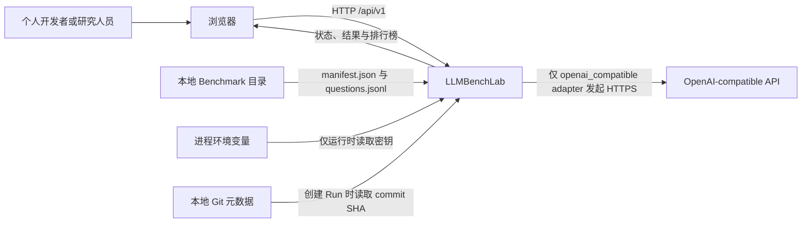
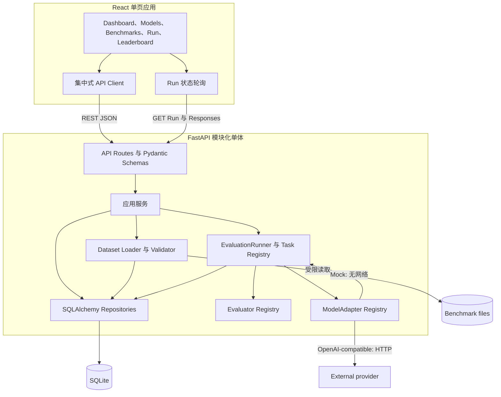
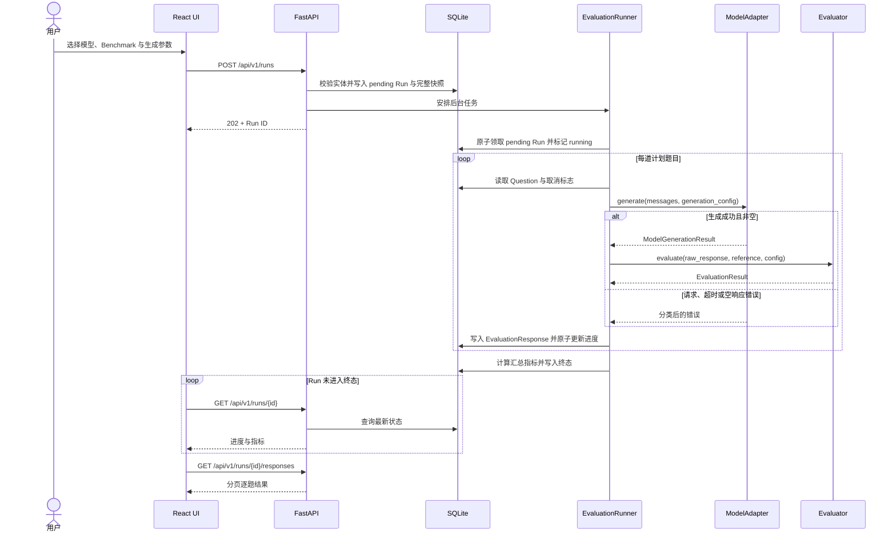
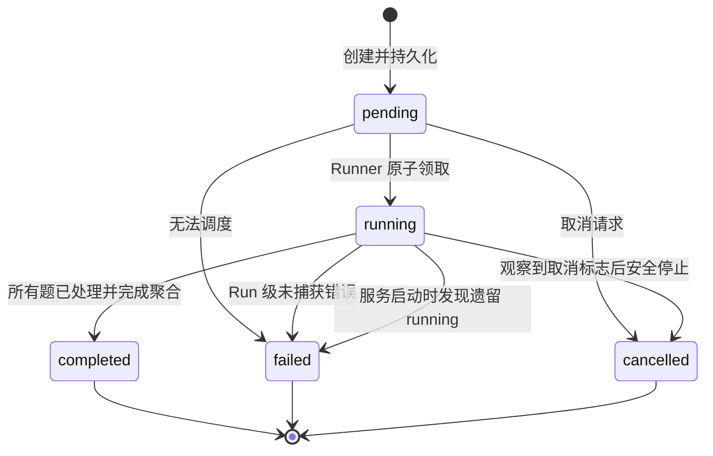
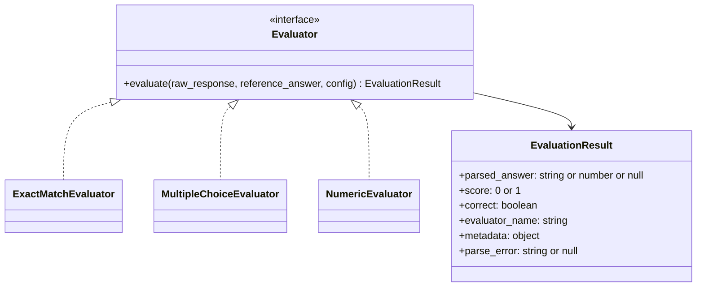
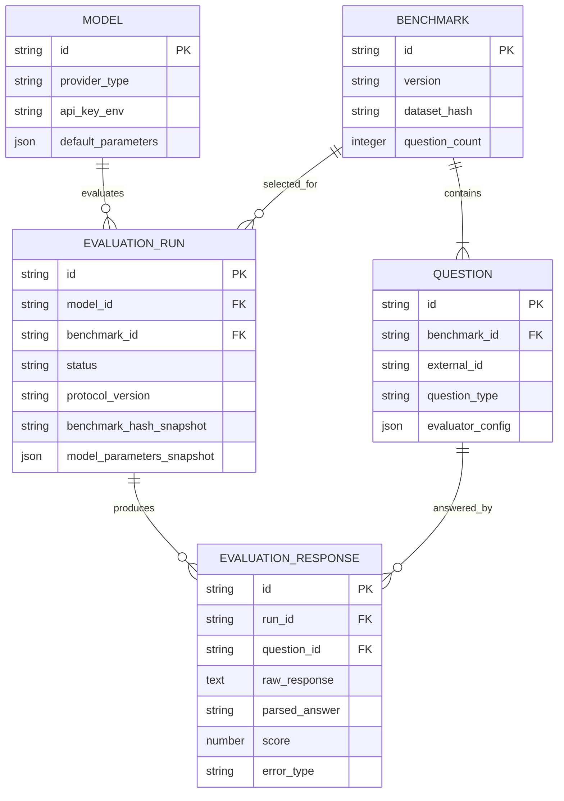

# LLMBenchLab 架构

本文描述 LLMBenchLab Phase 0/Phase 1 的系统边界、模块职责、数据流和扩展约束。MVP 采用前后端分离的模块化单体：后端进程同时提供 REST API 和受控的进程内评测任务，SQLite 保存所有可复现记录；它不是面向公网或大规模并发的生产架构。

## 架构目标与原则

- **离线可验证**：Mock adapter、Demo Benchmark、测试和 CI 均不得访问真实模型 API。
- **可复现**：Run 保存模型、数据集、Evaluator、Prompt、生成参数、并发和重试策略的快照。
- **失败隔离**：单题失败被持久化并计 0 分，不中断其余题目。
- **秘密最小化**：数据库只保存环境变量名，不保存或返回密钥值。
- **MVP 克制**：不引入 Redis、独立 Worker、微服务或不可信代码执行。
- **边界稳定**：Adapter、Evaluator、Dataset Loader 和 Runner 通过明确接口解耦，便于后续替换实现。

## 系统上下文



信任边界如下：Benchmark 文件和用户提供的 `base_url` 均视为不可信输入；上游响应也不能直接作为日志或 HTML。Mock adapter 位于应用内部，必须完全离线。前端只处理后端返回的脱敏数据，不接触模型密钥。

## 容器与模块



| 模块 | 单一职责 | 不承担的职责 |
| --- | --- | --- |
| API Routes / Schemas | HTTP 校验、分页、状态码和输出脱敏 | 评分和供应商协议细节 |
| Application Services | 编排 CRUD、导入、创建/取消 Run | 长时间阻塞请求 |
| Dataset Loader | 限制文件、解析、逐字段校验、稳定 Hash | 下载远程数据或执行数据集代码 |
| EvaluationRunner | 领取 Run、调度逐题执行、进度与聚合 | 解析特定答案格式 |
| ModelAdapter | 把统一生成请求映射到具体模型 | 评分 |
| Evaluator | 安全解析答案并给出 0/1 分 | 调用模型或数据库 |
| Repository / ORM | 事务与持久化 | API 序列化和业务展示 |
| React UI | 用户操作、轮询和可视化 | 持有密钥或直接调用模型供应商 |

## 关键数据流

### 导入 Benchmark

1. API 接收受限的 Benchmark 目录或上传内容；任何路径都必须解析到允许的导入根目录内。
2. Loader 先检查文件名、大小、UTF-8 和 JSON 语法，再按照 [`DATASET_FORMAT.md`](./DATASET_FORMAT.md) 校验 Schema 与跨字段约束。
3. Loader 验证问题 ID 唯一、`question_count` 一致，以及题型与 Evaluator 映射兼容。
4. Loader 对规范化 manifest 和按原顺序排列的规范化题目计算 SHA-256。
5. Benchmark 与 Questions 在一个数据库事务中写入；任一题失败则整体回滚。
6. 相同 `id + version + hash` 可按幂等导入处理；相同 `id + version` 但 Hash 不同必须报冲突，不能静默覆盖。

### 创建并执行 Run



创建接口不等待评测完成。数据库提交成功但任务安排失败时，服务应把 Run 标记为 `failed` 并记录经脱敏的原因，不能留下无主的 `pending`。每处理完一题，无论正确、错误还是解析失败，`completed_questions` 都递增一次。

## Run 生命周期与并发控制



- 状态只允许沿上图迁移；终态不可重新启动。
- Runner 必须以条件更新 `pending -> running` 原子领取任务。更新不到记录代表已被领取或不再可运行，从而阻止同一 Run 被重复启动。
- 进程内 Task Registry 以 Run ID 去重；每个 Runner 用 semaphore 将该 Run 内的题目请求并发限制为 1–4，默认协议并发度为 1。
- 取消是协作式的：接口写入取消意图，Runner 在题目边界和可取消等待点检查；已发出的上游请求可能要等超时后结束。
- MVP 不恢复后台任务。应用启动时发现 `running` Run，应改为 `failed`，`error_message` 记录 `interrupted_by_process_restart`；已保存的逐题结果仍保留用于诊断，但不得进入排行榜。
- 单题异常只生成带 `error_type`/`error_message` 的 EvaluationResponse；只有 Runner 自身、数据库或聚合流程的未捕获异常才把整个 Run 标记为 `failed`。

## 模型适配器架构


统一语义为：

```text
generate(messages, generation_config) -> ModelGenerationResult
```

`messages` 是已经应用 Run 快照 Prompt 的消息数组；`generation_config` 至少承载 `temperature`、`top_p`、`max_tokens` 和 `seed`。Adapter Registry 根据 `provider_type` 选择实现：

- `mock`：使用输入中稳定标识或 Demo 题目映射产生可预测回答，不读取密钥且不得发起网络请求。
- `openai_compatible`：校验 `base_url` 和 `remote_model_name`，在调用前根据 `api_key_env` 读取环境变量，使用 Chat Completions 风格接口。对 429、部分 5xx 和暂时性网络错误执行有上限的指数退避；明显的 4xx 配置错误不重试。

Adapter 将供应商错误映射为稳定的内部分类，例如 `authentication_error`、`rate_limited`、`provider_4xx`、`provider_5xx`、`connect_timeout`、`read_timeout`、`network_error` 和 `empty_response`。日志和持久化错误不得包含 Authorization、密钥值或完整敏感响应头。

## Evaluator 架构



Evaluator Registry 由题型和 manifest 中的版本化映射选择实现。Evaluator 必须是确定性的纯业务逻辑，不访问网络和数据库：

- Exact Match 只做已声明的空白、换行和大小写规范化，不做语义模糊匹配。
- Multiple Choice 优先解析明确的最终答案表达；多个冲突候选必须返回 `parse_error`，不得猜测。
- Numeric 使用安全十进制/浮点解析和绝对、相对误差，不使用 `eval`，拒绝 NaN 与 Infinity。

原始回答、解析答案和标准答案快照分别保存。解析失败的 `score` 为 0，并记录 `parse_error`；详细规则见 [`BENCHMARK_PROTOCOL.md`](./BENCHMARK_PROTOCOL.md)。

## 数据持久化



SQLAlchemy ORM 模型与 Pydantic API Schema 分离。Alembic 是唯一受支持的 Schema 演进入口；应用启动只校验数据库已到达 Alembic head，不会隐式建表。隔离测试可用 metadata 创建临时表，但必须显式标记对应 revision，不能成为运行路径。

每个 Run 至少快照：

- Benchmark ID、版本、Dataset SHA-256；
- Evaluator 名称、版本和数据集级配置；逐题配置属于按 Hash 锁定且无更新 API 的不可变 Question 记录；
- Prompt template、system prompt；
- temperature、top_p、max_tokens、seed；
- 展示模型名、远端模型名、adapter 类型、Base URL、密钥环境变量名、价格和有效模型参数；
- Git commit SHA（无法读取时为 `null`）；
- 并发度、超时和重试策略；
- `protocol_version`、创建时间、开始时间和结束时间。

Runner 从 Run 快照读取模型连接配置、价格、生成参数、Prompt、并发、超时和重试策略，不回读可编辑 Model 的这些值。题目内容与逐题 Evaluator 配置通过不可变 Benchmark 记录和 `benchmark_hash_snapshot` 绑定；Phase 1 不提供 Benchmark/Question 更新或删除 API。

Model 的 `default_parameters` 在 Phase 1 只接受 Adapter 实际转发的 `temperature`、`top_p`、`max_tokens`、`seed`。创建 Run 时显式字段覆盖 Model 默认，省略字段才使用 Model 默认；`generation` 块因此只包含实际执行值，不把未转发的 Provider 扩展伪装成有效参数。

写入约束：

- 时间以 UTC 存储，API 使用带 `Z` 或显式偏移的 ISO 8601。
- JSON 字段只保存可序列化值；秘密值、Authorization 和未脱敏上游头禁止写入。
- `(benchmark_id, external_id)` 唯一；一个 Run 对同一 Question 最多一条 EvaluationResponse。
- 导入 Benchmark 使用整体事务；逐题结果和进度使用短事务，避免把网络请求包在数据库事务中。
- 聚合从已持久化的 Responses 计算，并在 Run 终态更新中一次写入，防止界面看到互相矛盾的终态指标。

## 错误处理与可观察性

| 层级 | 示例 | 行为 |
| --- | --- | --- |
| 请求校验 | 非法 provider 参数、未知 ID | 返回 4xx 与字段级可读错误，不创建副作用 |
| 数据集校验 | JSONL 第 8 行无效、重复题号 | 返回文件、行号、JSON Pointer、错误码与原因；事务回滚 |
| 单题生成 | 超时、429、空回答 | 有限重试后保存错误 Response，计 0 分，继续下一题 |
| 单题解析 | 多选冲突、非法数值 | 保存原始回答和 `parse_error`，计 0 分，继续下一题 |
| Run 级故障 | 数据库不可写、Runner 未捕获异常 | Run 标记 `failed`，保存脱敏错误并停止调度 |
| 进程重启 | 遗留 `running` | 启动清理标记 `failed/interrupted`，不自动恢复 |

Phase 1 使用基础文本日志，少数 Runner 错误会带 Run/Question 标识；统一结构化上下文与全局脱敏 filter 属于 Phase 2。当前 Adapter 会截断和脱敏面向 API 的上游错误，不记录 Authorization 或完整请求头；诊断日志仍必须遵守相同秘密边界。健康检查只检查应用与本地依赖，不探测真实模型 API。

## 部署拓扑与安全边界

默认开发拓扑为浏览器、单个 FastAPI 进程、单个 SQLite 文件和 Vite 开发服务器；Compose 只封装 backend/frontend，并通过 Volume 持久化 SQLite。CORS 只允许配置的前端 Origin。

MVP 对 `base_url` 的允许范围尚未达到公网多租户要求。即使 URL 格式有效，仍可能产生 SSRF；因此本版本仅供受信任的本地操作者使用，不应直接暴露公网。后续公开部署必须增加鉴权、URL allowlist、DNS/IP 重绑定防护、出站网络策略、上传隔离和资源配额。

## 当前限制

- 进程内任务不能跨进程协调，重启后不能自动续跑；多 Worker 部署会破坏本地 Task Registry 的唯一性假设。
- SQLite 适合单机低并发写入，不适合高并发任务队列或水平扩展。
- 上游是否真正遵守 `seed`、temperature 等参数由供应商决定；同配置不保证逐 token 完全确定。
- 仅支持客观的 exact match、multiple choice、numeric；不执行代码，不提供 LLM Judge、Arena、Agent 或长上下文专用协议。
- Benchmark 来自本地受信任操作者；尚无远程注册表、签名校验、隔离解压或恶意内容扫描。
- 单用户、无鉴权、无配额；只能在可信本地环境或受保护网络使用。
- 成本为基于配置单价和供应商 usage 的估算；usage 缺失时不能视为真实的 0 成本。

## 后续扩展方式

1. **可靠任务执行**：保持 Runner 的领取/执行接口，引入 PostgreSQL 的条件领取与 Redis/独立 Worker；增加 heartbeat、lease、幂等重试和断点恢复。
2. **数据集插件**：保持规范化 Question 边界，新增下载器、缓存、签名、分片和 dataset plugin；原始来源版本与转换器版本纳入 Hash 元数据。
3. **Evaluator 插件**：以版本化 Registry 增加 IFEval、代码沙箱、LLM Judge 和 Pairwise Judge；任何评分语义变化必须升级 protocol version。
4. **Adapter 扩展**：实现新的供应商 Adapter，而不是在 Runner 中添加条件分支；能力声明用于标识 seed、usage、工具调用和上下文窗口支持。
5. **Arena 与 Agent**：新增独立的 Match、Vote、Trajectory、ToolCall 等领域实体，不把交互式评测硬塞进单轮 EvaluationResponse。
6. **公共部署**：增加用户、项目、权限、审计、租户级秘密存储、速率限制和网络隔离后，才考虑公网服务。

这些扩展必须保持旧 Run 的快照可读，不得在无提示情况下把不同 `protocol_version` 或不同数据集 Hash 的结果合并比较。
