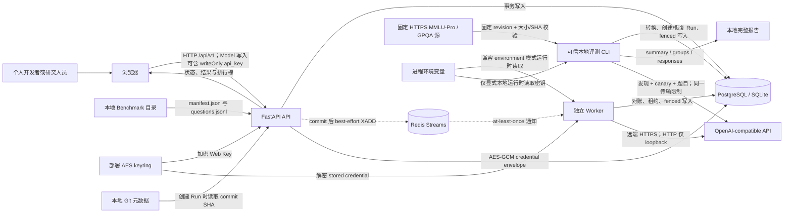
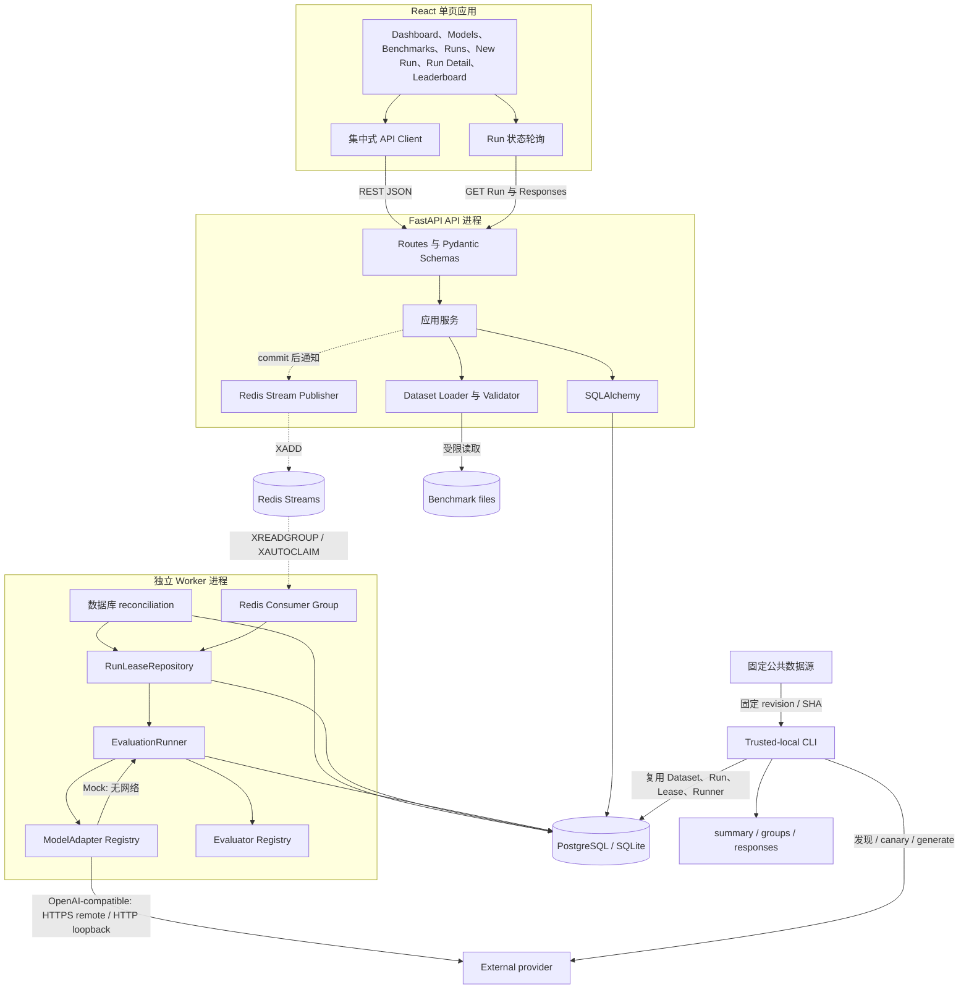
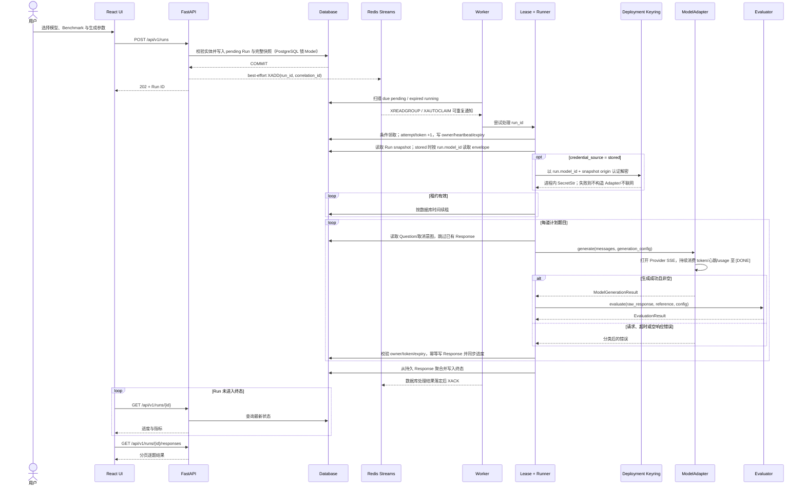
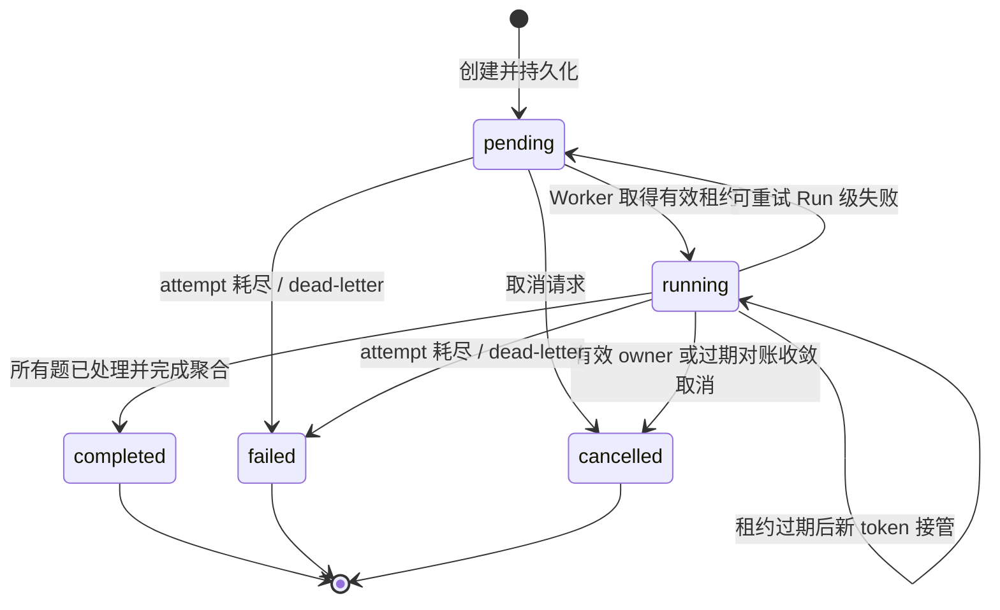
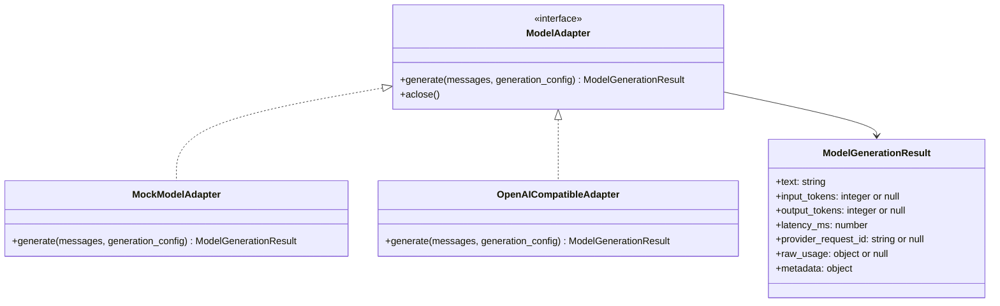
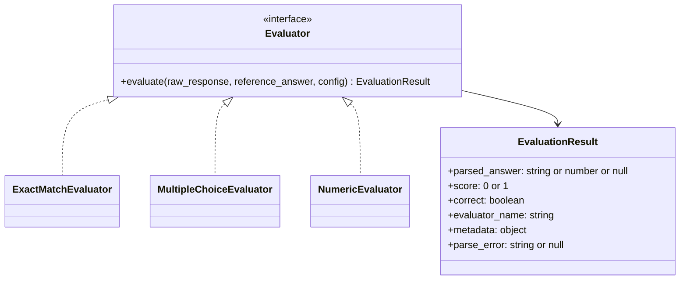
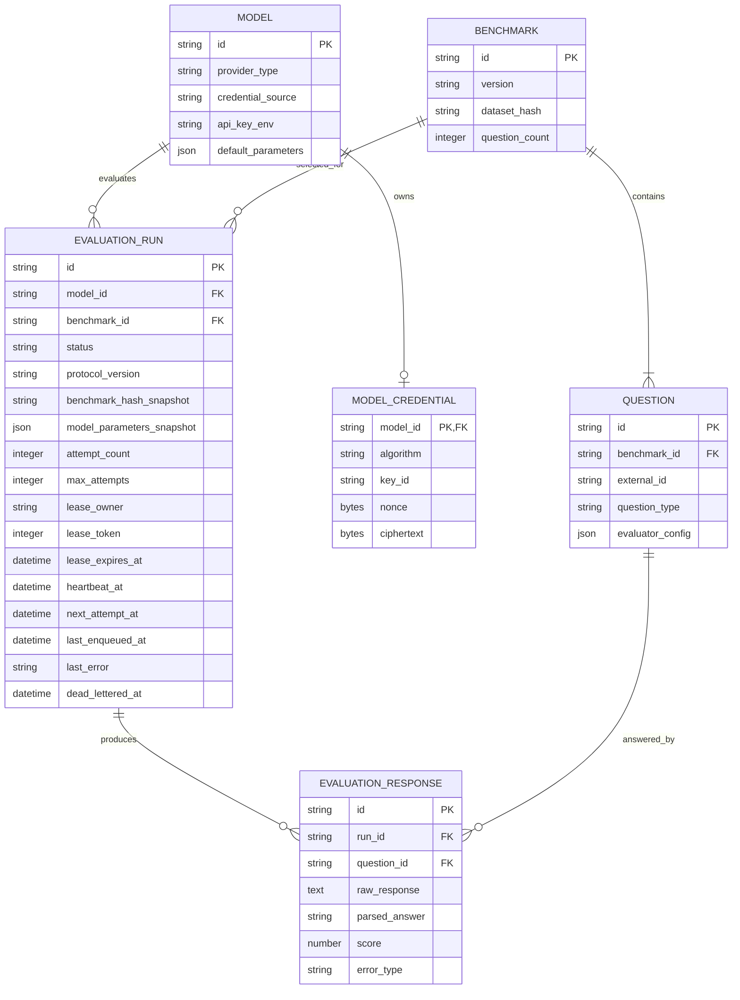

# LLMBenchLab 架构

本文描述 LLMBenchLab 当前 Phase 1 产品边界、Phase 2 可靠执行基础，以及可信本地 MMLU-Pro/GPQA-Diamond 真实评测垂直切片。前端仍通过 REST API 操作同一组领域对象，但 API 不执行评测：PostgreSQL/数据库是任务与评分证据的唯一事实来源，Redis Streams 是非权威的 at-least-once 通知层，独立 Worker 或受信本地 CLI 用数据库租约、心跳与 fencing 执行同一 Runner。SQLite 保留为单 Worker 本地兼容路径。Phase 2/3 总状态没有因此完成，这不是公网、HA 或生产架构声明。

## 架构目标与原则

- **离线可验证**：Mock adapter、Demo Benchmark、测试和 CI 均不得访问真实模型 API。
- **真实调用显式 opt-in**：受信本地操作者可以在 Web Model 表单写入 Provider Key 后主动创建 Run，也可使用带发现、canary 和费用确认的正式 CLI；Mock/测试路径始终离线。
- **可复现**：Run 保存模型、数据集、Evaluator、Prompt、生成参数、并发和重试策略的快照。
- **失败隔离**：单题失败被持久化并计 0 分，不中断其余题目。
- **秘密最小化**：Web Key 只以 AES-GCM authenticated ciphertext 持久化，部署 keyring 与数据库分离；兼容模式只保存环境变量名。API/Run/Response 不返回 Key 或 envelope，上游成功内容和相关标识在进入持久化边界前检查当前 Key 的精确反射。
- **事实单一**：Run 状态、取消意图、attempt、租约、Response、聚合、错误和 dead-letter 只由数据库裁决；Redis、日志、指标和内存不是事实来源。
- **at-least-once 与幂等**：通知可重复，逐题写入以 `(run_id, question_id)` 唯一并由当前 lease token fencing；不声称 Provider 调用或计费 exactly-once。
- **边界稳定**：Adapter、Evaluator、Dataset Loader 和 Runner 通过明确接口解耦，便于后续替换实现。

## 系统上下文



信任边界如下：Benchmark 文件、固定上游下载的内容和用户提供的 `base_url` 均视为不可信输入；上游响应也不能直接作为日志或 HTML。固定数据转换器以 revision、大小和 SHA-256 限定供应链，但 Hash 不是签名。Mock adapter 必须完全离线。浏览器只在 Model 表单提交期间持有 Web Key，并经受信 loopback 的 API 请求体发送；API 使用独立部署 keyring 加密后只写 envelope，Worker 使用同一 keyring 在请求前解密。兼容环境变量模式和受信本地 CLI 仍在执行进程中读取 Key。远端 Provider 只允许 HTTPS，明文 HTTP 仅允许字面 loopback/localhost；这仍不阻止 HTTPS 私网、云元数据或 DNS rebinding。任何非 loopback 浏览器/API 链路都必须另行提供 TLS、认证与授权。导出的报告虽经秘密脱敏，仍含题目和原始回答，属于敏感本地 artifact。

## 容器与模块



| 模块 | 单一职责 | 不承担的职责 |
| --- | --- | --- |
| API Routes / Schemas | HTTP 校验、分页、状态码和输出脱敏 | 评分和供应商协议细节 |
| Credential Crypto | 严格读取部署 keyring，以 AES-256-GCM 加解密并把 algorithm、Model ID、Provider origin 绑定为 AAD | ORM、HTTP、Provider 调用或秘密展示 |
| Application Services | 编排 CRUD、导入、创建/取消 Run；commit 后 best-effort 通知 | 执行 Adapter 或长时间阻塞请求 |
| Dataset Loader | 限制文件、解析、逐字段校验、稳定 Hash | 下载远程数据或执行数据集代码 |
| Standard Dataset Converters | 固定下载/缓存 MMLU-Pro、GPQA，校验源 Hash 并生成 dataset-v1 ZIP | 接受任意 URL、解释许可或执行题目代码 |
| Trusted-local CLI | prepare、Provider preflight/确认、创建/恢复 Run、驱动 Runner、导出报告 | 提供公网 API、保存明文 Key、全局预算或多租户调度 |
| Provider Preflight | 推导 `/models`、拒绝 Key 反射、确定模型、执行最小可解析且返回模型一致的 Chat canary | 猜测多个付费目标或证明供应商完全兼容 |
| Report Exporter | 分页读取终态证据，从计划题与 Responses 派生唯一指标集并原子写出三文件 | 覆盖已有报告、充当访问控制或修改 Run |
| Redis queue | 提供低延迟、at-least-once 通知和 ACK/PEL | 保存权威状态、租约、取消或结果 |
| WorkerService | 数据库对账、消费/确认通知、优雅停机 | 改变评分协议或用 Redis 裁决状态 |
| RunLeaseRepository | 条件领取、心跳、fencing、幂等 Response、retry/cancel/dead-letter | Provider 网络请求 |
| EvaluationRunner | 在有效租约下调度逐题执行、跳过已有 Response、聚合 | 解析特定答案格式 |
| ModelAdapter | 把统一生成请求映射到具体模型 | 评分 |
| Evaluator | 安全解析答案并给出 0/1 分 | 调用模型或数据库 |
| Repository / ORM | 事务与持久化 | API 序列化和业务展示 |
| React UI | 用户操作、write-only Key 表单、轮询和可视化 | 持久化/读回 Key、读取 keyring 或直接调用模型供应商 |

## 关键数据流

### 导入 Benchmark

1. API 接收受限的 Benchmark 目录或上传内容；任何路径都必须解析到允许的导入根目录内。
2. Loader 先检查文件名、大小、UTF-8 和 JSON 语法，再按照 [`DATASET_FORMAT.md`](./DATASET_FORMAT.md) 校验 Schema 与跨字段约束。
3. Loader 验证问题 ID 唯一、`question_count` 一致，以及题型与 Evaluator 映射兼容。
4. Loader 对规范化 manifest 和按原顺序排列的规范化题目计算 SHA-256。
5. Benchmark 与 Questions 在一个数据库事务中写入；任一题失败则整体回滚。
6. 相同 `id + version + hash` 可按幂等导入处理；相同 `id + version` 但 Hash 不同必须报冲突，不能静默覆盖。

标准数据转换是上述导入之前的受限供应链步骤：代码中固定 MMLU-Pro test/validation 或 GPQA archive 的 HTTPS URL、revision、大小和 SHA-256；缓存命中也重新校验。转换 profile、group/limit、GPQA seed 与转换器版本形成稳定版本指纹，生成的 ZIP 再完整经过普通 Loader。manifest 的 `source` 只是已验证事实说明，普通 Importer 仍不会跟随它联网。

### 注册与更新 Provider 凭据

Model 的凭据来源是显式状态，而不是从 nullable 字段猜测：`mock` 使用 `none`；旧客户端/可信 CLI 的 `api_key_env` 使用 `environment`；Web/API write-only `api_key` 使用 `stored`。

1. 浏览器只在 Model create/PATCH 请求体的 `api_key` 字段提交明文；Pydantic 用 `SecretStr` 接收并校验 8–8192 bytes、可见 ASCII 和无首尾空白，422 响应不保留原始 `input`/`ctx`。
2. API 从部署 keyring 选择 active 32-byte key，以 AES-256-GCM 和随机 12-byte nonce 加密。AAD 固定包含算法、Model ID 和规范化 Provider origin（scheme、host、非默认 port；不含路径），因此 envelope 不能跨 Model 或 origin 转发。
3. `model_credentials` 以 `model_id` 同时作为主键和到 `models.id` 的级联外键，保存 `algorithm/key_id/nonce/ciphertext` 与时间戳；没有 plaintext 列。公开 Model 只返回非秘密凭据状态和 legacy environment 变量名称，不会序列化该关系。
4. create/PATCH 在加密前把新 Key 与精确 `ModelRead` 全字段投影及 Run snapshot 的 `model` 子投影比较；PATCH 保留 stored row 时只为同一 fail-closed 比较解密旧 Key。省略 `api_key` 时保留 row；替换 Key 时用新 nonce 重加密。规范化 origin 改变必须重输 Key；切换到 `mock` 或 `environment` 删除 encrypted row。该边界防止凭据流复制，不扫描无关 Benchmark/Question 内容，也不承诺排除独立的字面巧合。
5. stored row 缺失或现有 envelope 因未知/旧 `key_id`、损坏密文而不可读时，可在 active keyring 可用时通过隔离的凭据 PATCH 用显式新 Key 覆盖，或只切换 `mock`/legacy environment 清理；夹带无关公开字段变化返回 422，没有新 Key 却保留 `stored` 返回 503，两者都不修改事务。
6. `pending/running` Run 存在时，Provider 类型、endpoint、远端模型和 credential 的敏感更新返回 409。Run 创建与 Model 更新共用方言锁：PostgreSQL 对 Model 行执行 `SELECT ... FOR UPDATE`，SQLite 在读 Model 前执行 `BEGIN IMMEDIATE`，把 Model snapshot 创建与修改串行化。SQLite 的数据库级竞争可能短暂阻塞请求，因此只适合低并发本地模式；生产或并发评测推荐 PostgreSQL。AES-GCM 的 origin AAD 是竞态或数据库篡改后的最后认证边界。

部署 keyring 是 API 与 Worker 共同读取、但 frontend/migrate 不需要的独立秘密。API 仅用于加密，Worker 仅在 stored Run 执行前解密；keyring 缺失、格式错误、未知 key id 或认证失败均 fail closed。环境变量来源与可信本地 CLI 保持原行为，不会被隐式迁移成 stored credential。

### 创建并执行 Run



创建接口不等待评测完成，也不在 API 进程内启动 Adapter。固定顺序是“数据库 COMMIT，再 XADD”：COMMIT 失败绝不通知；XADD 失败时保留可恢复的 `pending` Run、尝试写入 `last_error=queue_notification_unavailable`，仍返回 `202`。Worker 的数据库对账修复 commit/XADD 裂缝、Redis 丢消息或暂时不可用。

Run 没有 credential 外键或 envelope 列；`model_parameters_snapshot.model` 只冻结来源、Model ID、远端模型和 endpoint，environment 模式另存环境变量名称。stored 模式由 Worker 按 `run.model_id` 读取当前受保护的 `model_credentials` 行，并用 **Run snapshot 的 Base URL origin** 做 AAD，而不是读取当前 Model endpoint。active-run 更新锁保证正常操作期间 row 不会被替换；即使绕过业务层发生竞态或篡改，错误 Model/origin 的认证也会在任何 Provider 网络调用前失败。

Redis 通知和 ACK 都可重复，所以系统是 at-least-once；数据库中每题只保留一条 Response，并从 Response 事实重算进度和聚合。但若 Worker 在 Provider 已返回、Response 事务提交前崩溃，接管 Worker 可能再次调用 Provider；本架构不保证远程调用或计费 exactly-once。

### 可信本地正式评测

正式 CLI 绕过浏览器/API/Redis 控制面，但不绕过数据、协议或持久化边界：

1. `prepare` 下载固定源、校验并转换；不读取 Key 或连接 Provider。
2. `run` 强制选择 `--limit` 或 `--full`，从环境变量/隐藏输入取得 Key，使用兼容根路径调用 `GET /models`；远端只允许 HTTPS，HTTP 仅允许 loopback，发现请求只接受 identity 编码且正文上限 2 MiB，多模型时不猜测目标，任何模型 ID 反射当前 Key 都使预检失败。
3. CLI 输出 host、模型、题数、剩余 Run attempts 和最大 Chat HTTP 尝试数并要求确认；上界按 `(缺失题数 × 剩余 Run attempts + 1 个 canary) × 3` 包含 HTTP retries，再执行一个最小可解析、可能计费的 canary。若成功体明确返回其他模型名，canary 失败。
4. 通过 preflight 后才持久化 Benchmark、Model 和带脱敏 preflight/完整配置快照的 pending Run，并在同一进程用独立 lease owner 驱动现有 Runner。
5. Runner 先启动租约心跳，再通过工作线程加载和物化数据库快照，避免大题集同步加载阻塞事件循环；随后以固定 `min(concurrency, question_count)` 个消费者协程从迭代器取题，不为 12,032 题一次性创建 task。Response 仍逐题短事务、fencing 与幂等。
6. `resume` 重新确认/canary；若旧的未完成租约已经过期，本地 Runner 会执行 fenced reclaim，而不是等待已经停止的外部 Worker。恢复时跳过已有 Response，只执行缺失题。`report` 仅读取终态数据库事实，不接触 Provider。
7. Exporter 分页读取全部证据，以不可变计划题数和 Responses 重新派生 summary/groups 的同一指标集；`metrics_provenance` 标出数据库 Run 汇总字段漂移。三文件先写入权限收紧的临时目录并同步，再原子发布到一个不存在的目标目录；失败不留下伪装完成的报告。

这条路径要求先停止常规 API/Worker 并由 CLI 独占同一数据库，尤其 SQLite 只能有一个执行者。代码只能拒绝已有 `running` Run，不能探测空闲 Worker 并阻止它抢 `pending`。preflight、确认和限题降低误配置成本，但不等于 Provider RPM/TPM、金额预算硬边界或远端 exactly-once。

## Run 生命周期与并发控制



- 状态只允许沿上图迁移；终态不可重新领取且不保留 owner/expiry/heartbeat。
- 数据库当前时间是租约裁决标准。领取在同一条件更新/事务内令 `attempt_count` 和单调 `lease_token` 加 1，写入 owner/heartbeat/expiry；影响 0 行的 Worker 不得执行。
- 心跳只能续期尚未过期且 owner/token 匹配的租约。Response、进度、retry、取消、完成和失败写入都必须在事务内再次校验；旧 token 永久失效。
- 每个 Worker/本地 CLI 同时执行一个 Run；每个 Runner 用固定数量消费者将 Run 内题目并发限制为 1–4，默认为 1。Provider 限流、全局预算、完整背压与公平调度尚未实现。
- 取消是协作式：pending 直接收敛；running 先持久化意图，有效 owner 在题目/心跳边界处理；Worker 已死则由过期对账收敛。已发出且无法撤销的上游请求可能继续至返回或超时。
- Run 级可重试失败以有限指数退避回到 pending；attempt 耗尽时先从持久化 Responses 聚合部分证据，再进入 `failed`，`dead_lettered_at` 是权威 dead-letter 证据。Redis dead-letter 通知即使存在也只能是派生信号。
- 如已持久 Response 数等于计划题数，Worker/对账直接从事实聚合 `completed`，不为补终态而多耗 attempt 或再调 Provider。
- 单题异常生成带 `error_type`/`error_message` 的 EvaluationResponse 并计 0 分，不改变 `llmbenchlab-protocol-v1` 的分母、完成率或已回答准确率含义。

## 模型适配器架构



统一语义为：

```text
generate(messages, generation_config) -> ModelGenerationResult
```

`messages` 是已经应用 Run 快照 Prompt 的消息数组；`generation_config` 至少承载 `temperature`、`top_p`、`max_tokens` 和 `seed`。`max_tokens` 为 `1..131072` 的数字时由 Adapter 原样发送，为 `null` 时不发送该字段并由 Provider 选择默认预算；这不等于无限输出。Prompt 渲染只在 manifest `system` 含非空白内容时插入 system message；空 system 被省略。当前 GPQA-Diamond 固定 `zero-shot-cot-answer-line-v1`，要求模型推理后在末行输出 `Answer: X`；MMLU-Pro 与 GPQA 的标准 system 都为空。上述 profile/省略规则属于模型输入身份，必须随模板与 Dataset Hash 一起比较。

Adapter Registry 根据 `provider_type` 选择实现：

- `mock`：使用输入中稳定标识或 Demo 题目映射产生可预测回答，不读取密钥且不得发起网络请求。
- `openai_compatible`：校验 `base_url` 和 `remote_model_name`，并要求恰好一种凭据输入：environment Run 在调用前按 `api_key_env` 读取，stored Run 由 Worker 传入已解密的 `SecretStr`。Adapter 不读取数据库或 keyring。远端 URL 必须为 HTTPS，HTTP 仅允许 loopback；请求声明 `Accept-Encoding: identity` 并拒绝压缩响应。Chat payload 显式发送 `stream:true` 与 `stream_options.include_usage:true`，request-local parser 支持任意字节/UTF-8 分块、SSE comment 心跳、多 `data` 行、role/null delta、usage-only 尾块和 `[DONE]`，并只聚合 `delta.content`；推理扩展字段不混入评测答案。看到 finish reason 不会提前返回，HTTP 干净 EOF 却缺少 `[DONE]` 不作成功；忽略 stream 请求而返回普通 JSON 的 Provider 继续兼容。普通 JSON 成功体上限 4 MiB，SSE wire/单事件/聚合 content 上限分别为 64 MiB/1 MiB/4 MiB，非 2xx 错误体上限 64 KiB。对 429、部分 5xx 和暂时性 transport 错误仍执行快照内有上限的指数退避；明显的 4xx 配置错误不重试。

Adapter 将供应商错误映射为稳定的内部分类，例如 `authentication_error`、`rate_limited`、`provider_4xx`、`provider_5xx`、`connect_timeout`、`read_timeout`、`network_error`、`invalid_provider_stream`、`provider_stream_error`、`incomplete_provider_stream`、`empty_response` 和 `output_truncated`。Provider 以 `finish_reason="length"` 返回空内容时，Adapter 直接产生 `output_truncated`；返回非空内容但 Evaluator 无法解析有效最终答案时，Runner 根据同一 finish reason 把普通 parse error 提升为 `output_truncated`，并保留已有 raw response、usage、延迟与成本证据。日志和持久化错误不得包含 Authorization、密钥值、原始 SSE 行/事件或完整敏感响应头。SSE content 先聚合再执行当前 Key 的精确替换，避免 Key 横跨 delta 时泄漏。Provider 返回证据会递归检查成功内容、raw usage 的对象键和 JSON 标量，以及 provider request ID、返回模型名、system fingerprint 和 finish reason；其中出现的当前 Key 会先做精确替换。这不是对任意敏感内容的通用 DLP，也不扫描与 Provider 响应无关的固定数据。

## Evaluator 架构



Evaluator Registry 由题型和 manifest 中的版本化映射选择实现。Evaluator 必须是确定性的纯业务逻辑，不访问网络和数据库：

- Exact Match 只做已声明的空白、换行和大小写规范化，不做语义模糊匹配。
- Multiple Choice 优先解析明确的最终答案表达；多个冲突候选必须返回 `parse_error`，不得猜测。
- Numeric 使用安全十进制/浮点解析和绝对、相对误差，不使用 `eval`，拒绝 NaN 与 Infinity。

原始回答、解析答案和标准答案快照分别保存。解析失败的 `score` 为 0，并记录 `parse_error`；详细规则见 [`BENCHMARK_PROTOCOL.md`](./BENCHMARK_PROTOCOL.md)。

## 数据持久化



SQLAlchemy ORM 模型与 Pydantic API Schema 分离。Alembic 是唯一受支持的 Schema 演进入口；应用启动只校验数据库已到达 Alembic head，不会隐式建表。Compose 只允许一次性 `migrate` service 执行 migration，API 和 Worker 不并发抢占 schema owner。隔离测试可用 metadata 创建临时表，但必须显式标记对应 revision，不能成为运行路径。

PostgreSQL 是共享部署目标，并提供真实多 Worker 条件领取、行锁和数据库时间语义。SQLite 继续使用同一 ORM/Alembic head，仅支持单 Worker 本地开发、离线 Smoke 和兼容测试，不声称多 Worker 安全或生产能力。

每个 Run 至少快照：

- Benchmark ID、版本、Dataset SHA-256；
- Evaluator 名称、版本和数据集级配置；逐题配置属于按 Hash 锁定且无更新 API 的不可变 Question 记录；
- Prompt template、system prompt；
- temperature、top_p、max_tokens（数字或 `null`）、seed；
- 展示模型名、远端模型名、adapter 类型、Base URL、`credential_source`、价格和有效模型参数；environment 模式另含密钥环境变量名，stored 模式不含 Key/envelope/reference；
- Git commit SHA（无法读取时为 `null`）；
- 并发度、连接/读取/写入/连接池超时和重试策略；其中读取超时由 Run 请求在 `1..1800` 秒内选择，省略时为 `60` 秒；
- `protocol_version`、创建时间、开始时间和结束时间。
- 可信本地正式 Run 的初次模型发现/canary 脱敏结果：是否发现、候选数/request ID，以及返回模型、system fingerprint、finish reason、usage、延迟和尝试次数；不含 Key/header。`resume` 的新 canary 当前不会追加为独立审计事件。

Runner 从 Run 快照读取模型连接配置、凭据来源、价格、生成参数、Prompt、并发、超时和重试策略，不回读可编辑 Model 的这些值。environment 模式按快照变量名取值；stored 模式仅按 `run.model_id` 读取 envelope，并用快照 Base URL origin 认证解密。题目内容与逐题 Evaluator 配置通过不可变 Benchmark 记录和 `benchmark_hash_snapshot` 绑定；Phase 1 不提供 Benchmark/Question 更新或删除 API。

Model 的 `default_parameters` 在 Phase 1 只接受 Adapter 实际转发的 `temperature`、`top_p`、`max_tokens`、`seed`。创建 Run 时显式字段覆盖 Model 默认，省略字段才使用 Model 默认；显式 `max_tokens:null` 也是覆盖值，不会回退。`generation` 块因此只包含实际执行值，不把未转发的 Provider 扩展伪装成有效参数。通用 API 保留 protocol-v1 的 `max_tokens=256` 和读取超时 `60s` 默认；没有对应 Model 默认且用户尚未手动修改时，Web 根据已知 Benchmark 提交可编辑的显式建议：Demo `256/60s`、MMLU-Pro direct `1024/180s`、official CoT `4000/300s`、GPQA-Diamond `8192/600s`。

React 主导航包含独立的 Runs 列表页。该页通过 `GET /runs` 以 20 条为一页显示所有状态，支持状态筛选，并在当前页存在 active Run 时轮询；列表和 Run Detail 都以持久化 Run ID 建立链接。Run Detail 对 `GET /runs/{id}/responses` 使用每页 100 条的 offset 分页，而不是只加载大型正式 Benchmark 的前 100 条；active Run 继续轮询当前证据页，进入终态后停止。

写入约束：

- 时间以 UTC 存储，API 使用带 `Z` 或显式偏移的 ISO 8601。
- JSON 字段只保存可序列化值；plaintext Key、Authorization 和未脱敏上游头禁止写入。`model_credentials` 只允许受约束的 AES-GCM envelope，SQL engine 隐藏 bound parameters。
- `(benchmark_id, external_id)` 唯一；一个 Run 对同一 Question 最多一条 EvaluationResponse。
- 导入 Benchmark 使用整体事务；逐题结果和进度使用短事务，避免把网络请求包在数据库事务中。
- 只有 owner/token 匹配、租约未过期的 Worker 能写 Response、进度、费用、retry 或终态；唯一约束是最后的竞态防线，不替代 fencing。
- 聚合从已持久化的 Responses 计算，并在 completed、cancelled 或 dead-letter 终态更新前写回 Run。报告仍防御性地从计划题与 Responses 重算唯一主指标，并只用 `metrics_provenance` 标注 Run 字段漂移，保证 summary/groups/responses 不互相矛盾。

### SQLite 到 PostgreSQL 的显式导入

数据库平台迁移是 stopped-source/offline-empty-target 操作，不是双写或在线复制：

1. 停止 SQLite 源的 API/Worker 和新 Run 创建，确认无 `pending/running` Run。导入器使用 read-only URI，校验 integrity、foreign keys 和 Alembic head，不修改源文件。
2. PostgreSQL 目标必须已在 head，六张核心表必须为空且不可对外服务。事务级 advisory lock 在空库检查之前串行化竞争导入，随后对 `alembic_version` 和核心表取 `ACCESS EXCLUSIVE` 锁。
3. `models → model_credentials → benchmarks → questions → evaluation_runs → evaluation_responses` 六表在一个目标事务中按依赖顺序复制，包括 encrypted credential envelope，但不解密或输出其列值。源、precommit target 都只输出 row count、主键集 digest 和 canonical row digest；任一 precommit 失配/复制失败都整体 rollback，CLI 退出 `2`。
4. COMMIT 确认后，工具在独立的只读 `REPEATABLE READ` 事务中取稳定 postcommit snapshot，再对账并输出第三组摘要。全部完成才退出 `0`。

带凭据的目标 DSN 必须通过 `--target-env` 从受控环境读取；`--target` 拒绝 URL password 和 password query。COMMIT 未获得 PostgreSQL 确认时退出 `4`/`commit_outcome_unknown`；由于事务原子性，目标可能为空，也可能是完整的 precommit 快照。COMMIT 已确认但连接收尾、postcommit 快照/对账或报告失败时退出 `3`/`committed_but_verification_failed`；这时目标已提交完整 precommit 快照，不会自动回滚。两种结果都禁止盲目重试，必须保持目标离线，按已输出摘要独立检查目标是空还是完整提交。非空目标会拒绝再次导入，工具也不提供 PostgreSQL 到 SQLite 的反向同步。

## 错误处理与可观察性

| 层级 | 示例 | 行为 |
| --- | --- | --- |
| 请求校验 | 非法 provider 参数、未知 ID | 返回 4xx 与字段级可读错误，不创建副作用 |
| 数据集校验 | JSONL 第 8 行无效、重复题号 | 返回文件、行号、JSON Pointer、错误码与原因；事务回滚 |
| 单题生成 | 超时、429、空回答、非法/不完整 SSE | 暂时性 transport 有限重试；最终失败或协议错误保存错误 Response，计 0 分，继续下一题 |
| 单题解析 | 多选冲突、非法数值 | 保存原始回答和 `parse_error`，计 0 分，继续下一题 |
| Run 级故障 | Runner 未捕获异常 | 有效 owner 以有限退避重新 pending；attempt 耗尽则 failed/dead-letter |
| 通知故障 | XADD/read/ACK 超时或 Redis 停机 | 保留 DB 事实，记录脱敏状态，数据库 reconciliation 恢复 |
| 租约丢失 | heartbeat 失败、过期或 token 被接管 | 取消并等待本 Worker 在途题，拒绝所有旧 token 写入，不 ACK 不确定结果 |
| 进程重启 | API 或 Worker 中断 | API 不改写 Run；Worker 租约自然过期后由 peer/新 Worker 跳过已有 Response 接管 |

可观测基础包含：

- API 忽略客户端传入的 `X-Request-ID`，为每个请求始终生成全新的 server-side UUID 并在响应中回传。CORS 请求 header allowlist 不含 `X-Request-ID`，但会向浏览器暴露响应中的该 header，避免客户端把 write-only Key 复制到 correlation ID 后迫使服务反射或记录。新 Run 使用 run ID 作为稳定 correlation ID，通知、Worker、Runner 和 Question 事件继承该链路。
- LLMBenchLab **应用 logger** 使用字段白名单的 JSON formatter，记录 request route template、run/question/worker、attempt、lease token、message ID 和结果；不记录请求体、header、原始回答或异常文本，只可记异常类型。这一保证不涵盖所有 Uvicorn/access log handler，所以秘密不得出现在 URL、query 或 path。这些生命周期日志也不是不可篡改的完整审计日志。
- `/live` 是纯进程存活检查，不访问 DB/Redis/Provider；`/health` 保持 DB-only 兼容语义；`/ready` 并行检查 DB 连接/Alembic head 与 Redis，不探测 Provider。Redis 失败时返回 `503/degraded`，但 DB/head 可用时 `accepting_runs=true` 且对账可用；DB/head 失败时 `not_ready` 且不接收任务。
- `/ready` 将同步 DB 探测放入 `asyncio.to_thread` 并限制 HTTP 等待时间。async timeout 不会取消已进入线程的驱动调用；后台资源的真正上界仍依赖数据库 driver/connect/pool timeout。
- `/tasks/metrics` 在一次 DB 查询中派生 pending/due/running/expired/cancellation/retry/dead-letter/queue-notification-error 数和当前 Run 的 attempt 总和。它们是当前 gauges，不是按事件持久的 counters、完整历史、处理延迟分布或审计记录。
- P2-06 的 Provider 审计仍有两个具体缺口：初次 canary 会随可信本地 Run 快照固化，但 `resume` 的 canary 不会形成独立追加事件；每题 transport 的 request ID、返回模型名和 system fingerprint 只存在于调用期结果，尚未写入 EvaluationResponse。
- Worker 容器探针检查 DB/head 和 Redis 能力。DB/head 失败退出 1；Redis 失败输出 degraded 但退出 0，因为 DB reconciliation 仍可用。它是 dependency/capability readiness，不是 Worker 主循环或 event-loop liveness。

## 部署拓扑与安全边界

本地 Make 模式启动 API、独立 Worker 和 Vite，默认 SQLite 且 Redis 可选；SQLite 只支持一个 Worker。`make setup` 与其他相关启动入口通过 `uv run --script` 显式选择满足 `>=3.11` 的独立 CPython，再由 bootstrap 为 Web credential 生成 Git 忽略、权限为 `0600` 的 `.secrets/credential-keys.json`，API 与 Worker 读取同一文件；这避免 `PATH` 中其他 Python 实现破坏安全原子安装语义，也不会为 Docker-only 入口同步宿主后端依赖。可信本地 CLI 是第三条运维入口：它直接复用当前数据库与 Runner，因此运行时必须停止连接同库的常规 API/Worker 并独占数据库，默认把下载、转换 ZIP 与报告放入 Git 忽略的 `artifacts/`。Compose 包含六个 service：长运行的 PostgreSQL、Redis、API、Worker、frontend，以及一次性 migrate；同一只读 Compose secret 只挂载到 API/Worker。PostgreSQL/Redis 各自使用 named volume，Redis 启用 AOF；API/frontend host port 明确绑定 loopback，DB/Redis 无 host port。CORS 只允许配置的前端 Origin。

当前 Compose 只是本地开发/故障验收拓扑，示例数据库密码不是生产秘密管理。前端 Nginx 位于浏览器→API 路径，不代表 Worker→Provider 路径上的 Cloudflare、Caddy 或其他 Gateway；真 SSE 必须在这条上游链路上保留正确 Content-Type 并持续 flush，且仍受每层独立的缓冲/超时限制。虽然远端 Provider 已强制 HTTPS、明文 HTTP 只允许 loopback，`base_url` 的允许范围仍未达到公网多租户要求；有效的 HTTPS URL 仍可能指向私网/云元数据或发生 DNS rebinding。本版本仅供受信任的本地操作者使用，不应直接暴露公网。后续公开部署必须增加鉴权、TLS、URL allowlist、DNS/IP 重绑定防护、出站网络策略、上传隔离、权限拆分、备份/PITR 和资源配额。当前不声称生产、HA 或灾备 SLA。

## 当前限制

- PostgreSQL 租约已支持受限多 Worker 协调；SQLite 仍只适合单 Worker、单机低并发。这不是无限水平扩展或 HA 保证。
- Provider 级限流、全局预算、完整队列背压、公平调度和性能/容量基线尚未完成。
- 当前 DB metrics 只是 gauges，不包含完整事件 counters、延迟分布、不可篡改审计、tracing、监控面板或告警；尤其缺少 resume canary 独立事件和逐题 Provider transport 标识持久化。
- at-least-once 不能防止 Provider 响应到本地 COMMIT 之间崩溃导致的重复远程调用/费用，只保证本地证据幂等。
- 上游是否真正遵守 `seed`、temperature 等参数由供应商决定；同配置不保证逐 token 完全确定。
- 仅支持客观的 exact match、multiple choice、numeric；不执行代码，不提供 LLM Judge、Arena、Agent 或长上下文专用协议。
- Benchmark 可来自本地受信任操作者，或两个固定公共数据转换器；尚无通用远程注册表、发布者签名、隔离解压或恶意内容扫描。
- MMLU-Pro `direct`/`official_cot`、group/limit、GPQA shuffle seed 或 Dataset Hash 不同的结果不可直接比较；公共题污染与 Provider 同名模型滚动更新仍无法由平台消除。
- 单用户、无鉴权、无配额；只能在可信本地环境或受保护网络使用。
- Web credential 使用本地文件 keyring，而不是集中 secrets manager/HSM；keyring 丢失会使 stored rows 不可恢复，数据库与 keyring 同时泄漏则可解密，因此必须分开备份和限制访问。
- 成本为基于配置单价和供应商 usage 的估算；usage 缺失时不能视为真实的 0 成本。

## 后续扩展方式

1. **可靠性治理收口**：在已有 PostgreSQL/Redis/Worker/租约基础上增加 Provider 限流、预算、完整背压与公平调度，并补齐历史 counters/延迟、审计和性能基线。
2. **数据集插件**：在已有固定 MMLU-Pro/GPQA 转换器上增加通用注册、签名、分片和更多 dataset plugin；继续把原始来源版本与转换器版本纳入 Hash 元数据。
3. **Evaluator 插件**：以版本化 Registry 增加 IFEval、代码沙箱、LLM Judge 和 Pairwise Judge；任何评分语义变化必须升级 protocol version。
4. **Adapter 扩展**：实现新的供应商 Adapter，而不是在 Runner 中添加条件分支；能力声明用于标识 seed、usage、工具调用和上下文窗口支持。
5. **Arena 与 Agent**：新增独立的 Match、Vote、Trajectory、ToolCall 等领域实体，不把交互式评测硬塞进单轮 EvaluationResponse。
6. **公共部署**：增加用户、项目、权限、审计、租户级秘密存储、速率限制和网络隔离后，才考虑公网服务。

这些扩展必须保持旧 Run 的快照可读，不得在无提示情况下把不同 `protocol_version` 或不同数据集 Hash 的结果合并比较。
