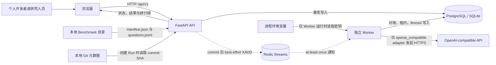
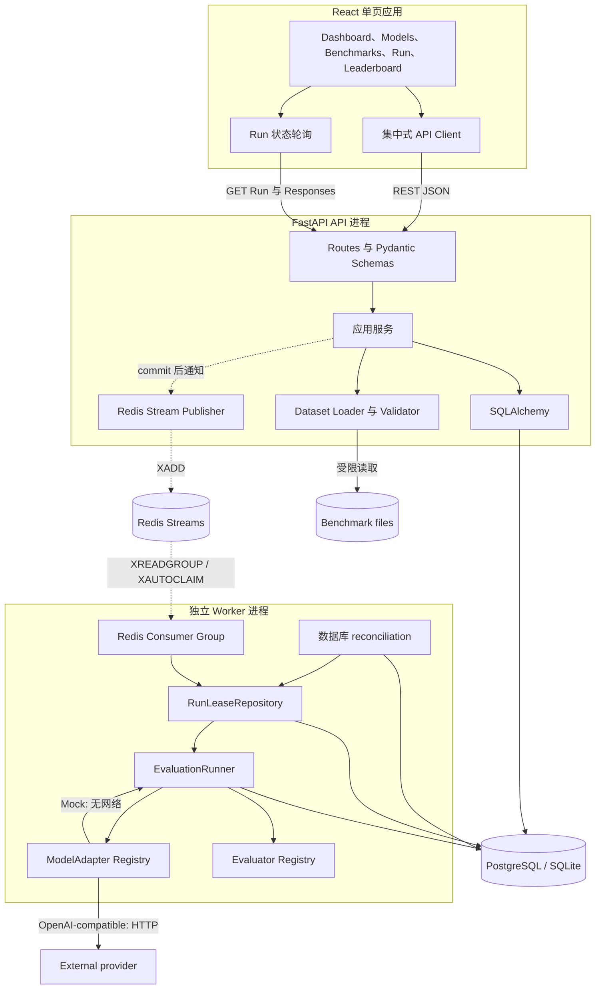
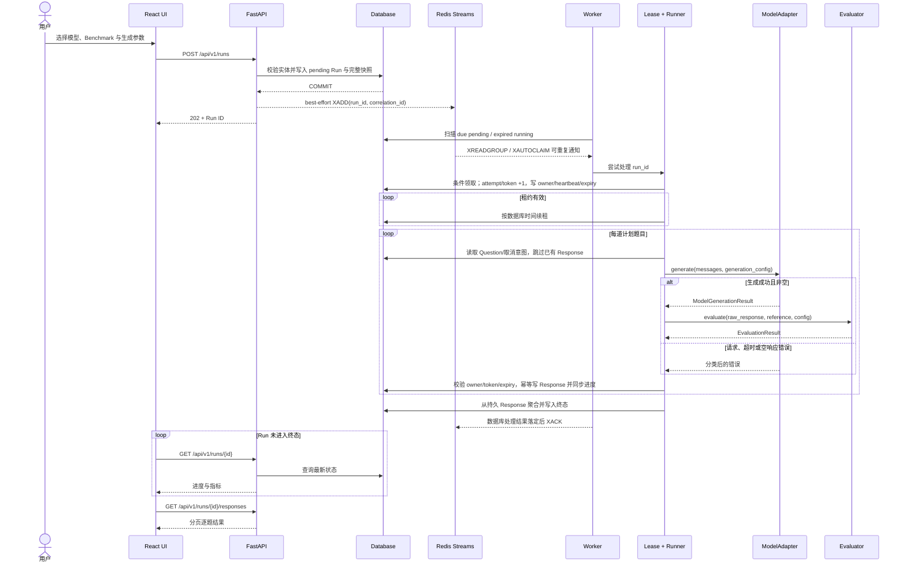
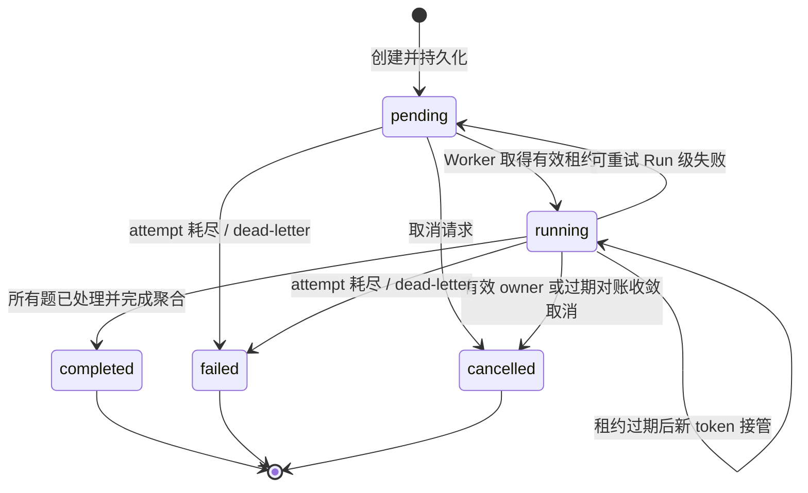
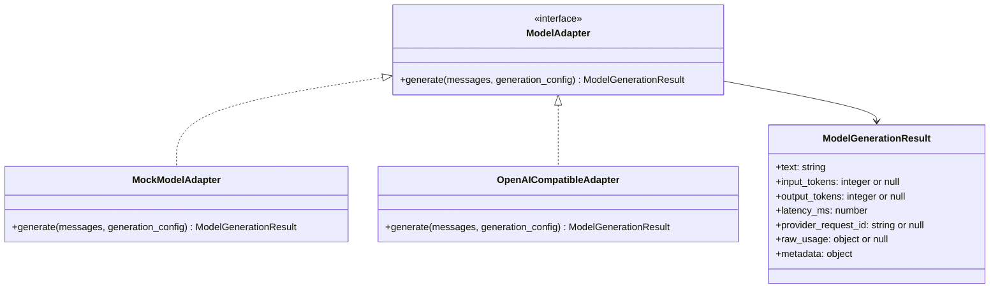
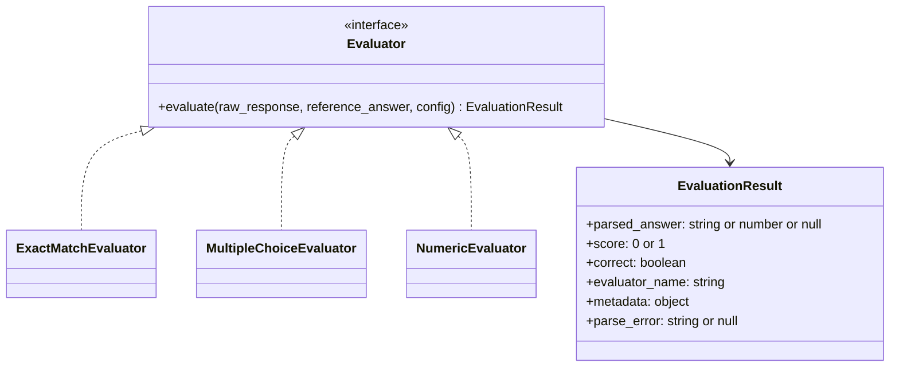
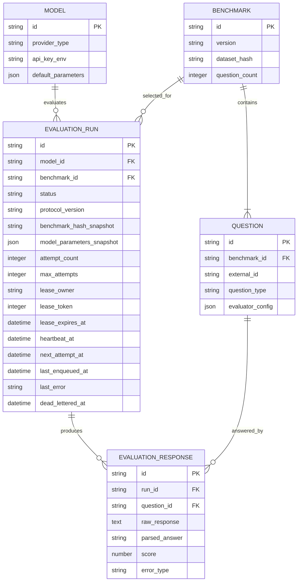

# LLMBenchLab 架构

本文描述 LLMBenchLab 当前 Phase 1 产品边界和 Phase 2 可靠执行基础。前端仍通过 REST API 操作同一组领域对象，但 API 不再执行评测：PostgreSQL/数据库是任务与评分证据的唯一事实来源，Redis Streams 是非权威的 at-least-once 通知层，独立 Worker 用数据库租约、心跳与 fencing 执行现有 Runner。SQLite 保留为单 Worker 本地兼容路径。Phase 2 总状态仍为 `in_progress`，这不是公网、HA 或生产架构声明。

## 架构目标与原则

- **离线可验证**：Mock adapter、Demo Benchmark、测试和 CI 均不得访问真实模型 API。
- **可复现**：Run 保存模型、数据集、Evaluator、Prompt、生成参数、并发和重试策略的快照。
- **失败隔离**：单题失败被持久化并计 0 分，不中断其余题目。
- **秘密最小化**：数据库只保存环境变量名，不保存或返回密钥值。
- **事实单一**：Run 状态、取消意图、attempt、租约、Response、聚合、错误和 dead-letter 只由数据库裁决；Redis、日志、指标和内存不是事实来源。
- **at-least-once 与幂等**：通知可重复，逐题写入以 `(run_id, question_id)` 唯一并由当前 lease token fencing；不声称 Provider 调用或计费 exactly-once。
- **边界稳定**：Adapter、Evaluator、Dataset Loader 和 Runner 通过明确接口解耦，便于后续替换实现。

## 系统上下文



信任边界如下：Benchmark 文件和用户提供的 `base_url` 均视为不可信输入；上游响应也不能直接作为日志或 HTML。Mock adapter 位于 Worker 内部，必须完全离线。API 只保存 Provider 密钥环境变量名，真实值只注入执行 Adapter 的 Worker。前端只处理后端返回的数据，不接触模型密钥。

## 容器与模块



| 模块 | 单一职责 | 不承担的职责 |
| --- | --- | --- |
| API Routes / Schemas | HTTP 校验、分页、状态码和输出脱敏 | 评分和供应商协议细节 |
| Application Services | 编排 CRUD、导入、创建/取消 Run；commit 后 best-effort 通知 | 执行 Adapter 或长时间阻塞请求 |
| Dataset Loader | 限制文件、解析、逐字段校验、稳定 Hash | 下载远程数据或执行数据集代码 |
| Redis queue | 提供低延迟、at-least-once 通知和 ACK/PEL | 保存权威状态、租约、取消或结果 |
| WorkerService | 数据库对账、消费/确认通知、优雅停机 | 改变评分协议或用 Redis 裁决状态 |
| RunLeaseRepository | 条件领取、心跳、fencing、幂等 Response、retry/cancel/dead-letter | Provider 网络请求 |
| EvaluationRunner | 在有效租约下调度逐题执行、跳过已有 Response、聚合 | 解析特定答案格式 |
| ModelAdapter | 把统一生成请求映射到具体模型 | 评分 |
| Evaluator | 安全解析答案并给出 0/1 分 | 调用模型或数据库 |
| Repository / ORM | 事务与持久化 | API 序列化和业务展示 |
| React UI | 用户操作、轮询和可视化 | 持有密钥或直接调用模型供应商 |

## 关键数据流

### 导入 Benchmark

1. API 接收受限的 Benchmark 目录或上传内容；任何路径都必须解析到允许的导入根目录内。
2. Loader 先检查文件名、大小、UTF-8 和 JSON 语法，再按照 [`DATASET_FORMAT.md`](./DATASET_FORMAT.md) 校验 Schema 与跨字段约束。
3. Loader 验证问题 ID 唯一、`question_count` 一致，以及题型与 Evaluator 映射兼容。
4. Loader 对规范化 manifest 和按原顺序排列的规范化题目计算 SHA-256。
5. Benchmark 与 Questions 在一个数据库事务中写入；任一题失败则整体回滚。
6. 相同 `id + version + hash` 可按幂等导入处理；相同 `id + version` 但 Hash 不同必须报冲突，不能静默覆盖。

### 创建并执行 Run



创建接口不等待评测完成，也不在 API 进程内启动 Adapter。固定顺序是“数据库 COMMIT，再 XADD”：COMMIT 失败绝不通知；XADD 失败时保留可恢复的 `pending` Run、尝试写入 `last_error=queue_notification_unavailable`，仍返回 `202`。Worker 的数据库对账修复 commit/XADD 裂缝、Redis 丢消息或暂时不可用。

Redis 通知和 ACK 都可重复，所以系统是 at-least-once；数据库中每题只保留一条 Response，并从 Response 事实重算进度和聚合。但若 Worker 在 Provider 已返回、Response 事务提交前崩溃，接管 Worker 可能再次调用 Provider；本架构不保证远程调用或计费 exactly-once。

## Run 生命周期与并发控制



- 状态只允许沿上图迁移；终态不可重新领取且不保留 owner/expiry/heartbeat。
- 数据库当前时间是租约裁决标准。领取在同一条件更新/事务内令 `attempt_count` 和单调 `lease_token` 加 1，写入 owner/heartbeat/expiry；影响 0 行的 Worker 不得执行。
- 心跳只能续期尚未过期且 owner/token 匹配的租约。Response、进度、retry、取消、完成和失败写入都必须在事务内再次校验；旧 token 永久失效。
- 每个 Worker 同时执行一个 Run；每个 Runner 用 semaphore 将 Run 内题目并发限制为 1–4，默认为 1。Provider 限流、全局预算、完整背压与公平调度尚未实现。
- 取消是协作式：pending 直接收敛；running 先持久化意图，有效 owner 在题目/心跳边界处理；Worker 已死则由过期对账收敛。已发出且无法撤销的上游请求可能继续至返回或超时。
- Run 级可重试失败以有限指数退避回到 pending；attempt 耗尽时进入 `failed`，`dead_lettered_at` 是权威 dead-letter 证据。Redis dead-letter 通知即使存在也只能是派生信号。
- 如已持久 Response 数等于计划题数，Worker/对账直接从事实聚合 `completed`，不为补终态而多耗 attempt 或再调 Provider。
- 单题异常生成带 `error_type`/`error_message` 的 EvaluationResponse 并计 0 分，不改变 `llmbenchlab-protocol-v1` 的分母、完成率或已回答准确率含义。

## 模型适配器架构



统一语义为：

```text
generate(messages, generation_config) -> ModelGenerationResult
```

`messages` 是已经应用 Run 快照 Prompt 的消息数组；`generation_config` 至少承载 `temperature`、`top_p`、`max_tokens` 和 `seed`。Adapter Registry 根据 `provider_type` 选择实现：

- `mock`：使用输入中稳定标识或 Demo 题目映射产生可预测回答，不读取密钥且不得发起网络请求。
- `openai_compatible`：校验 `base_url` 和 `remote_model_name`，在调用前根据 `api_key_env` 读取环境变量，使用 Chat Completions 风格接口。对 429、部分 5xx 和暂时性网络错误执行有上限的指数退避；明显的 4xx 配置错误不重试。

Adapter 将供应商错误映射为稳定的内部分类，例如 `authentication_error`、`rate_limited`、`provider_4xx`、`provider_5xx`、`connect_timeout`、`read_timeout`、`network_error` 和 `empty_response`。日志和持久化错误不得包含 Authorization、密钥值或完整敏感响应头。

## Evaluator 架构



Evaluator Registry 由题型和 manifest 中的版本化映射选择实现。Evaluator 必须是确定性的纯业务逻辑，不访问网络和数据库：

- Exact Match 只做已声明的空白、换行和大小写规范化，不做语义模糊匹配。
- Multiple Choice 优先解析明确的最终答案表达；多个冲突候选必须返回 `parse_error`，不得猜测。
- Numeric 使用安全十进制/浮点解析和绝对、相对误差，不使用 `eval`，拒绝 NaN 与 Infinity。

原始回答、解析答案和标准答案快照分别保存。解析失败的 `score` 为 0，并记录 `parse_error`；详细规则见 [`BENCHMARK_PROTOCOL.md`](./BENCHMARK_PROTOCOL.md)。

## 数据持久化



SQLAlchemy ORM 模型与 Pydantic API Schema 分离。Alembic 是唯一受支持的 Schema 演进入口；应用启动只校验数据库已到达 Alembic head，不会隐式建表。Compose 只允许一次性 `migrate` service 执行 migration，API 和 Worker 不并发抢占 schema owner。隔离测试可用 metadata 创建临时表，但必须显式标记对应 revision，不能成为运行路径。

PostgreSQL 是共享部署目标，并提供真实多 Worker 条件领取、行锁和数据库时间语义。SQLite 继续使用同一 ORM/Alembic head，仅支持单 Worker 本地开发、离线 Smoke 和兼容测试，不声称多 Worker 安全或生产能力。

每个 Run 至少快照：

- Benchmark ID、版本、Dataset SHA-256；
- Evaluator 名称、版本和数据集级配置；逐题配置属于按 Hash 锁定且无更新 API 的不可变 Question 记录；
- Prompt template、system prompt；
- temperature、top_p、max_tokens、seed；
- 展示模型名、远端模型名、adapter 类型、Base URL、密钥环境变量名、价格和有效模型参数；
- Git commit SHA（无法读取时为 `null`）；
- 并发度、超时和重试策略；
- `protocol_version`、创建时间、开始时间和结束时间。

Runner 从 Run 快照读取模型连接配置、价格、生成参数、Prompt、并发、超时和重试策略，不回读可编辑 Model 的这些值。题目内容与逐题 Evaluator 配置通过不可变 Benchmark 记录和 `benchmark_hash_snapshot` 绑定；Phase 1 不提供 Benchmark/Question 更新或删除 API。

Model 的 `default_parameters` 在 Phase 1 只接受 Adapter 实际转发的 `temperature`、`top_p`、`max_tokens`、`seed`。创建 Run 时显式字段覆盖 Model 默认，省略字段才使用 Model 默认；`generation` 块因此只包含实际执行值，不把未转发的 Provider 扩展伪装成有效参数。

写入约束：

- 时间以 UTC 存储，API 使用带 `Z` 或显式偏移的 ISO 8601。
- JSON 字段只保存可序列化值；秘密值、Authorization 和未脱敏上游头禁止写入。
- `(benchmark_id, external_id)` 唯一；一个 Run 对同一 Question 最多一条 EvaluationResponse。
- 导入 Benchmark 使用整体事务；逐题结果和进度使用短事务，避免把网络请求包在数据库事务中。
- 只有 owner/token 匹配、租约未过期的 Worker 能写 Response、进度、费用、retry 或终态；唯一约束是最后的竞态防线，不替代 fencing。
- 聚合从已持久化的 Responses 计算，并在 Run 终态更新中一次写入，防止界面看到互相矛盾的终态指标。

### SQLite 到 PostgreSQL 的显式导入

数据库平台迁移是 stopped-source/offline-empty-target 操作，不是双写或在线复制：

1. 停止 SQLite 源的 API/Worker 和新 Run 创建，确认无 `pending/running` Run。导入器使用 read-only URI，校验 integrity、foreign keys 和 Alembic head，不修改源文件。
2. PostgreSQL 目标必须已在 head，五张核心表必须为空且不可对外服务。事务级 advisory lock 在空库检查之前串行化竞争导入，随后对 `alembic_version` 和核心表取 `ACCESS EXCLUSIVE` 锁。
3. 五表在一个目标事务中按依赖顺序复制。源、precommit target 都输出不含内容的 row count、主键集 digest 和 canonical row digest；任一 precommit 失配/复制失败都整体 rollback，CLI 退出 `2`。
4. COMMIT 确认后，工具在独立的只读 `REPEATABLE READ` 事务中取稳定 postcommit snapshot，再对账并输出第三组摘要。全部完成才退出 `0`。

带凭据的目标 DSN 必须通过 `--target-env` 从受控环境读取；`--target` 拒绝 URL password 和 password query。COMMIT 未获得 PostgreSQL 确认时退出 `4`/`commit_outcome_unknown`；由于事务原子性，目标可能为空，也可能是完整的 precommit 快照。COMMIT 已确认但连接收尾、postcommit 快照/对账或报告失败时退出 `3`/`committed_but_verification_failed`；这时目标已提交完整 precommit 快照，不会自动回滚。两种结果都禁止盲目重试，必须保持目标离线，按已输出摘要独立检查目标是空还是完整提交。非空目标会拒绝再次导入，工具也不提供 PostgreSQL 到 SQLite 的反向同步。

## 错误处理与可观察性

| 层级 | 示例 | 行为 |
| --- | --- | --- |
| 请求校验 | 非法 provider 参数、未知 ID | 返回 4xx 与字段级可读错误，不创建副作用 |
| 数据集校验 | JSONL 第 8 行无效、重复题号 | 返回文件、行号、JSON Pointer、错误码与原因；事务回滚 |
| 单题生成 | 超时、429、空回答 | 有限重试后保存错误 Response，计 0 分，继续下一题 |
| 单题解析 | 多选冲突、非法数值 | 保存原始回答和 `parse_error`，计 0 分，继续下一题 |
| Run 级故障 | Runner 未捕获异常 | 有效 owner 以有限退避重新 pending；attempt 耗尽则 failed/dead-letter |
| 通知故障 | XADD/read/ACK 超时或 Redis 停机 | 保留 DB 事实，记录脱敏状态，数据库 reconciliation 恢复 |
| 租约丢失 | heartbeat 失败、过期或 token 被接管 | 取消并等待本 Worker 在途题，拒绝所有旧 token 写入，不 ACK 不确定结果 |
| 进程重启 | API 或 Worker 中断 | API 不改写 Run；Worker 租约自然过期后由 peer/新 Worker 跳过已有 Response 接管 |

可观测基础包含：

- API 接受 1–128 字符、只含字母数字与 `-._:` 的 `X-Request-ID`；非法/缺失值由服务生成，每个响应回传。新 Run 使用 run ID 作为稳定 correlation ID，通知、Worker、Runner 和 Question 事件继承该链路。
- LLMBenchLab **应用 logger** 使用字段白名单的 JSON formatter，记录 request route template、run/question/worker、attempt、lease token、message ID 和结果；不记录请求体、header、原始回答或异常文本，只可记异常类型。这一保证不涵盖所有 Uvicorn/access log handler，所以秘密不得出现在 URL、query 或 path。这些生命周期日志也不是不可篡改的完整审计日志。
- `/live` 是纯进程存活检查，不访问 DB/Redis/Provider；`/health` 保持 DB-only 兼容语义；`/ready` 并行检查 DB 连接/Alembic head 与 Redis，不探测 Provider。Redis 失败时返回 `503/degraded`，但 DB/head 可用时 `accepting_runs=true` 且对账可用；DB/head 失败时 `not_ready` 且不接收任务。
- `/ready` 将同步 DB 探测放入 `asyncio.to_thread` 并限制 HTTP 等待时间。async timeout 不会取消已进入线程的驱动调用；后台资源的真正上界仍依赖数据库 driver/connect/pool timeout。
- `/tasks/metrics` 在一次 DB 查询中派生 pending/due/running/expired/cancellation/retry/dead-letter/queue-notification-error 数和当前 Run 的 attempt 总和。它们是当前 gauges，不是按事件持久的 counters、完整历史、处理延迟分布或审计记录。
- Worker 容器探针检查 DB/head 和 Redis 能力。DB/head 失败退出 1；Redis 失败输出 degraded 但退出 0，因为 DB reconciliation 仍可用。它是 dependency/capability readiness，不是 Worker 主循环或 event-loop liveness。

## 部署拓扑与安全边界

本地 Make 模式启动 API、独立 Worker 和 Vite，默认 SQLite 且 Redis 可选；SQLite 只支持一个 Worker。Compose 包含六个 service：长运行的 PostgreSQL、Redis、API、Worker、frontend，以及一次性 migrate。PostgreSQL/Redis 各自使用 named volume，Redis 启用 AOF；API/frontend host port 明确绑定 loopback，DB/Redis 无 host port。CORS 只允许配置的前端 Origin。

当前 Compose 只是本地开发/故障验收拓扑，示例数据库密码不是生产秘密管理。`base_url` 的允许范围也尚未达到公网多租户要求；即使 URL 格式有效，仍可能产生 SSRF。本版本仅供受信任的本地操作者使用，不应直接暴露公网。后续公开部署必须增加鉴权、TLS、URL allowlist、DNS/IP 重绑定防护、出站网络策略、上传隔离、权限拆分、备份/PITR 和资源配额。当前不声称生产、HA 或灾备 SLA。

## 当前限制

- PostgreSQL 租约已支持受限多 Worker 协调；SQLite 仍只适合单 Worker、单机低并发。这不是无限水平扩展或 HA 保证。
- Provider 级限流、全局预算、完整队列背压、公平调度和性能/容量基线尚未完成。
- 当前 DB metrics 只是 gauges，不包含完整事件 counters、延迟分布、不可篡改审计、tracing、监控面板或告警。
- at-least-once 不能防止 Provider 响应到本地 COMMIT 之间崩溃导致的重复远程调用/费用，只保证本地证据幂等。
- 上游是否真正遵守 `seed`、temperature 等参数由供应商决定；同配置不保证逐 token 完全确定。
- 仅支持客观的 exact match、multiple choice、numeric；不执行代码，不提供 LLM Judge、Arena、Agent 或长上下文专用协议。
- Benchmark 来自本地受信任操作者；尚无远程注册表、签名校验、隔离解压或恶意内容扫描。
- 单用户、无鉴权、无配额；只能在可信本地环境或受保护网络使用。
- 成本为基于配置单价和供应商 usage 的估算；usage 缺失时不能视为真实的 0 成本。

## 后续扩展方式

1. **可靠性治理收口**：在已有 PostgreSQL/Redis/Worker/租约基础上增加 Provider 限流、预算、完整背压与公平调度，并补齐历史 counters/延迟、审计和性能基线。
2. **数据集插件**：保持规范化 Question 边界，新增下载器、缓存、签名、分片和 dataset plugin；原始来源版本与转换器版本纳入 Hash 元数据。
3. **Evaluator 插件**：以版本化 Registry 增加 IFEval、代码沙箱、LLM Judge 和 Pairwise Judge；任何评分语义变化必须升级 protocol version。
4. **Adapter 扩展**：实现新的供应商 Adapter，而不是在 Runner 中添加条件分支；能力声明用于标识 seed、usage、工具调用和上下文窗口支持。
5. **Arena 与 Agent**：新增独立的 Match、Vote、Trajectory、ToolCall 等领域实体，不把交互式评测硬塞进单轮 EvaluationResponse。
6. **公共部署**：增加用户、项目、权限、审计、租户级秘密存储、速率限制和网络隔离后，才考虑公网服务。

这些扩展必须保持旧 Run 的快照可读，不得在无提示情况下把不同 `protocol_version` 或不同数据集 Hash 的结果合并比较。
